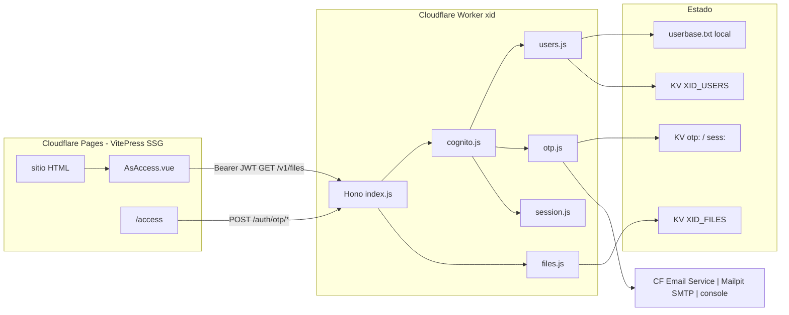
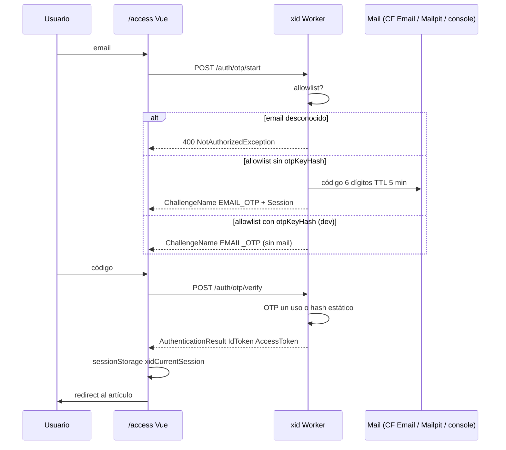
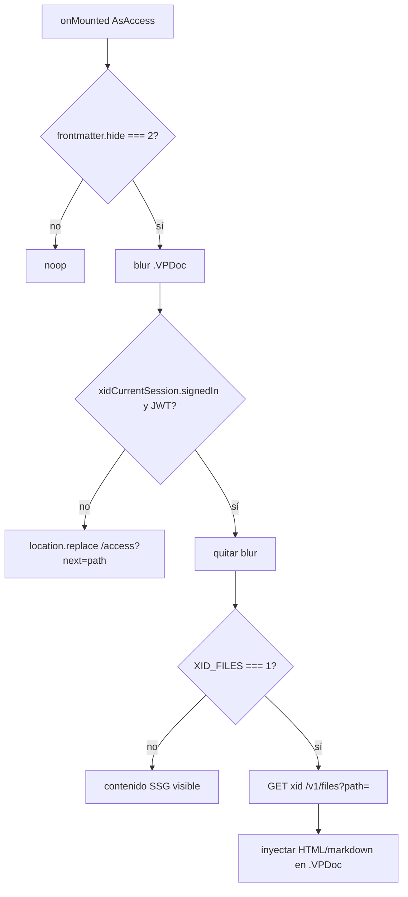

# Plan MVP: `xid` — autenticación OTP y acceso a artículos `hide: 2`

| Campo | Valor |
| --- | --- |
| **Título** | MVP `xid`: reemplazo de Userbase (API homologada con Cognito + OTP-Mail + file manager) |
| **Autor** | Cesar Andres Arcila Buitrago |
| **Fecha** | 2026-08-23 |
| **Estado** | Draft |
| **Alcance** | Paquete hermano `xid/` + integración mínima en PUB (3 PRs) |
| **Fuera de este documento** | Migración VitePress → Vinxi (`/PLAN.md` en la raíz). Una línea: **no forma parte de este MVP**. |

---

## Overview

PUB es un blog SSG con VitePress. El acceso opcional a páginas protegidas depende hoy del SDK de [Userbase](https://userbase.com/) (`PUB_USERBASE` inyecta `https://sdk.userbase.com/2/userbase.js`) y del componente `common/.vitepress/snippets/AsAccess.vue`, montado desde `common/.vitepress/theme/Layout.vue`. Ese gate está **roto** para `hide === 2`: siempre hace blur de `.VPDoc` y, tras 4 s, `history.back()`, incluso con sesión. El camino `user.signedIn` → unblur es código muerto.

Este MVP crea el paquete `xid/` (Hono + Bun en local, Cloudflare Workers en producción) que:

1. Autentica **solo emails en allowlist** con **OTP por correo** (sin contraseñas).
2. Expone un **subconjunto** de la API JSON de Cognito Identity Provider (no AWS Cognito).
3. Sirve un **file manager** mínimo: `GET` de recursos de artículos `hide: 2` si hay sesión válida.
4. Sustituye Userbase en PUB (`XID_PUB`, `AsAccess.vue`, README, `task/initialize.js`).

La seguridad del HTML estático **no mejora mágicamente**: VitePress publica el cuerpo en Cloudflare Pages (`task/publish.js` → `wrangler pages deploy`). El camino primario del MVP es el mismo modelo que Userbase (gate en cliente + sesión JWT) **arreglado**, más un API de ficheros autenticado. Un follow-up puede convertir las páginas `hide: 2` en stubs y rellenar el cuerpo desde `xid`.

---

## Background & Motivation

### Estado actual

| Pieza | Dónde | Comportamiento |
| --- | --- | --- |
| Flag SDK | `common/.vitepress/site-config.mjs` | Si `PUB_USERBASE`, añade el script de Userbase al `head`. |
| Scaffold `.env` | `task/initialize.js` | Comentario `# PUB_USERBASE=1`. |
| Docs | `README.md` § “Optional userbase auth” | Sin SDK, `hide: 1` / `hide: 2` quedan en blur o redirect porque no hay sesión. |
| Gate | `AsAccess.vue` | Solo actúa si `frontmatter.hide === 2`. |
| Config Userbase | `common/.vitepress/theme/userbase.config.js` | En `.gitignore`; **no existe en disco**. |
| Deploy sitio | `task/publish.js` | `wrangler pages deploy` del `dist` de VitePress. |
| Stack repo | `package.json` raíz | Scripts con Bun; `wrangler` ya es `devDependency` (`^4.0.0`). |
| `xid/` | carpeta vacía | Destino de este paquete. |
| `rag/` | MCP Orama | Paquete hermano. `rag/package.json` **no** depende de Hono. `xid` **no** vive dentro de `rag`. |

Semántica de `hide` (no se cambia en este MVP):

- `task/indexing.js` `pushArticles`: `hide = parseInt(frontmatter.hide) || (title ? 0 : 2)`.
- `rag/src/catalog.js` `VISIBILITY`: `0 = public`, `1 = protected`, `2 = hidden`.
- `buildSidebar()` en `site-config.mjs`: omite cualquier `article.hide` truthy (1 y 2 fuera del sidebar).
- Búsqueda local `_render`: si `frontmatter.hide === 2` devuelve HTML vacío.

### Bug de `AsAccess.vue` (debe corregirse al sustituir Userbase)

```21:43:common/.vitepress/snippets/AsAccess.vue
    if (frontmatter.value?.hide === 2) {
        const containerElement = document.querySelector('.VPDoc')
        // ... blur ...
        try {
            const user = JSON.parse(sessionStorage.getItem('userbaseCurrentSession'))
            if (frontmatter.value?.hide === 2) {
                Notify()
                setTimeout(() => { history.back() }, 4000)
            } else if (user.signedIn) {
                containerElement.style.filter = 'none'
                containerElement.style.userSelect = 'auto'
            }
        } catch (error) {
            // hide === 2 → history.back(); else → /access
        }
    }
```

El `if` interno vuelve a preguntar `hide === 2` (siempre true en este bloque). Nunca se evalúa `user.signedIn`. El `catch` también redirige atrás. **Hoy `hide: 2` no se desbloquea nunca**, con o sin Userbase.

### Dolor

- Dependencia de un SaaS de terceros (Userbase) para un caso de uso mínimo: “si el email está registrado, puede ver el artículo”.
- No hay almacenamiento de usuarios en el repo (solo un config gitignored que ni siquiera está presente).
- El gate no cumple su contrato.
- El HTML de Pages es público: el blur no es control de acceso real. El plan debe ser honesto al respecto.

---

## Goals & Non-Goals

### Goals

- Paquete `xid/` ejecutable con `bun run dev` y desplegable como Cloudflare Worker.
- Allowlist de emails: `userbase.txt` en local, KV en Cloudflare.
- OTP-Mail (código de 6 dígitos); **no** se almacenan contraseñas.
- API homologada con un **subconjunto** de Cognito IdP JSON + alias REST para Vue.
- `GET` autenticado de ficheros/artículos para `hide: 2` (ACL por artículo: no).
- Integración PUB: flag `XID_PUB`, dejar de inyectar `userbase.js`, arreglar `AsAccess.vue`, página `/access`, README e `initialize.js`.
- CORS hacia orígenes de los sitios Pages.

### Non-Goals

- Signup público, OAuth social, Hosted UI, Authorization Code.
- Almacenar hashes de contraseña.
- Superficie completa de AWS Cognito ni compatibilidad con el AWS SDK salvo los campos de las 4 operaciones listadas.
- ACL por artículo, roles, UI de administración.
- Migración Vinxi/Nitro (ver `PLAN.md` raíz; **fuera de alcance**).
- Cifrar el HTML SSG en reposo o en el `dist`.
- Cambiar el modelo de visibilidad de RAG (`rag/src/catalog.js`).
- Meter `xid` dentro de `rag/` ni reutilizar el Hono residual de `rag/node_modules`.

---

## Key Decisions

1. **Allowlist, no signup abierto.** El usuario pidió acceso “si está registrado (con email)”. `InitiateAuth` / `SignUp` para emails desconocidos → `NotAuthorizedException` / `403`. Alta = editar `userbase.txt` o escribir KV (script admin). *Rationale:* superficie mínima, sin spam de OTP a terceros.

2. **Sin passwords.** Solo OTP de un uso (TTL ~5 min) o clave estática de **dev** `email:key` hasheada al cargar. *Rationale:* el requisito explícito; Cognito se homologa por el *shape* de la API, no por USER_PASSWORD_AUTH.

3. **Subconjunto Cognito, no el producto AWS.** `POST /` con `X-Amz-Target: AWSCognitoIdentityProviderService.<Op>` + alias `/auth/otp/*` y `/cognito/<Op>`. Ops: `InitiateAuth`, `RespondToAuthChallenge`, `GetUser`, `GlobalSignOut`. `SignUp` stub 403. *Rationale:* un cliente futuro puede cambiar de host; PUB usa los alias REST.

4. **JWT HMAC (`XID_JWT_SECRET`), sin RefreshToken en el MVP.** Access + Id (~1 h). Claims `sub` = email, `token_use` = `access` \| `id` (como Cognito). *Rationale:* menos estado; re-login OTP es barato para un blog.

5. **Doble canal de sesión por orígenes distintos.** Pages (sitio) y Worker (`xid`) no comparten cookies. Vue guarda `{ signedIn, email, accessToken, idToken }` en `sessionStorage.xidCurrentSession`. El file API usa `Authorization: Bearer` y, en el origen del Worker, cookie `xid_session` HttpOnly. *Rationale:* mismo patrón que Userbase (`userbaseCurrentSession`) + cookie útil si se abre `/files` en el Worker.

6. **Camino primario de `hide: 2`: gate de cliente arreglado (misma seguridad que hoy).** El HTML sigue en Pages. Sesión válida → unblur; si no → `/access` (no `history.back()`). El file API existe y `AsAccess` **puede** pedir el markdown/cuerpo a `xid` para inyectarlo; eso no elimina la fuga del HTML ya publicado. *Follow-up:* build stub (cuerpo vacío en `dist` para `hide: 2`) + fetch obligatorio al Worker.

7. **Clave estática `email:otpKey` solo en local.** Al parsear `userbase.txt`, el `:key` se hashea (`SHA-256` del valor normalizado) y **no** se loguea. En KV de producción el campo `otpKeyHash` es opcional y **no** se debe subir desde el txt de dev como secreto de larga duración en claro. `RespondToAuthChallenge` acepta el código enviado por mail **o** el key estático si el hash coincide. `InitiateAuth` **no** reenvía mail si hay `otpKeyHash` (evita rxido en tests); en prod sin `otpKeyHash` siempre manda mail. *Rationale:* tests sin SMTP; no fingir que es un almacén de passwords.

8. **Mail: Cloudflare Email Service en prod; SMTP Mailpit en local.** No Resend, no SES, no MailChannels. En el Worker se usa el binding nativo `[[send_email]] name = "MAIL"` → `env.MAIL.send({ to, from, subject, text })` contra el dominio onboarded a Email Service. En `bun run dev` (Hono standalone, sin bindings de wrangler) `mail.js` envía por **SMTP a Mailpit** (`localhost:1025`, UI `http://localhost:8025`) para inspeccionar el OTP. Fallback final: imprimir el código en stdout solo si `XID_ENV=dev`. Env: `XID_MAIL_FROM`, `XID_SMTP_HOST` (default `127.0.0.1`), `XID_SMTP_PORT` (default `1025`). *Rationale:* primer-party de Cloudflare, cero API keys, sin salto a terceros; Mailpit es el contenedor ya activo en este repo; `wrangler dev` simula el binding (log + ficheros bajo miniflare) si se quiere probar esa ruta. **Caveat:** enviar a destinatarios arbitrarios requiere Workers Paid; enviar a destination addresses verificados de la cuenta es gratis.

9. **Ficheros: FS local + KV `XID_FILES` en Worker; R2 después.** Cualquier usuario allowlisted autenticado lee cualquier path bajo el root. *Rationale:* un KV basta para unos pocos markdown `hide: 2`; R2 es overkill para el MVP.

10. **`xid/` es paquete hermano de `rag/`, no un Worker dentro del tema VitePress.** Mismo patrón de carpeta de primer nivel. *Rationale:* runtime distinto (Worker vs SSG); wrangler propio.

11. **Hono `export default { fetch }`.** Sirve `bun --hot src/index.js` y `wrangler dev` / deploy. *Rationale:* un solo entrypoint.

---

## Proposed Design

### Layout del paquete

```
xid/
  PLAN.md
  package.json
  wrangler.toml
  src/
    index.js          # Hono app, export fetch
    cognito.js        # InitiateAuth, RespondToAuthChallenge, GetUser, GlobalSignOut
    users.js          # userbase.txt | KV XID_USERS
    otp.js            # generar / verificar OTP, adapter mail
    files.js          # GET autenticado
    session.js        # JWT HMAC + cookie
    mail.js           # Cloudflare Email binding | SMTP Mailpit | console
  scripts/
    bootstrap-kv.js   # userbase.txt → KV (one-shot)
  userbase.txt        # allowlist local (gitignored)
  files/              # root local opcional (gitignored contenido sensible)
```

`xid/package.json` (independiente, como `rag/`):

```json
{
  "name": "onmind-xid",
  "private": true,
  "type": "module",
  "scripts": {
    "dev": "bun --hot src/index.js",
    "start": "bun src/index.js",
    "cf:dev": "wrangler dev",
    "cf:deploy": "wrangler deploy",
    "kv:bootstrap": "bun scripts/bootstrap-kv.js"
  },
  "dependencies": {
    "hono": "^4"
  }
}
```

No hace falta jose: HMAC JWT se implementa en `session.js` con `crypto.subtle` (Workers + Bun).

### Arquitectura



### Flujo OTP



### Runtime local vs Cloudflare

| | Local (`bun run dev`) | Worker |
| --- | --- | --- |
| Usuarios | `userbase.txt` (FS) | KV `XID_USERS` |
| OTP / rate limit | `Map` in-memory **o** mismo KV si `wrangler dev` | KV prefix `otp:`, `rl:` |
| Ficheros | `XID_FILES_ROOT` (default `xid/files`) | KV `XID_FILES` (key = path) |
| Mail | SMTP Mailpit `XID_SMTP_HOST:XID_SMTP_PORT` (default `127.0.0.1:1025`, UI `:8025`); fallback stdout si `XID_ENV=dev` | binding `send_email` → Cloudflare Email Service (`env.MAIL.send()`); `wrangler dev` lo simula (log + ficheros) |
| Bindings | env `.env` / `xid/.dev.vars` | `wrangler.toml` + secrets |

Detección: si existe `env.XID_USERS` (binding KV) → adapter KV; si no → txt.

### Gate PUB (después del fix)



`hide: 1` hoy **no** está implementado en `AsAccess` (solo `=== 2`). El MVP **no** inventa semántica nueva para `hide: 1` salvo documentar: sidebar ya lo oculta; el cuerpo SSG sigue público. Follow-up si se quiere el mismo gate.

---

## API / Interface Changes

Protocolo Cognito: `Content-Type: application/x-amz-json-1.1` (también se acepta `application/json`). Errores: HTTP 400 + JSON `{ "__type": "<Exception>", "message": "..." }` como IdP.

`ClientId` se valida contra env `XID_CLIENT_ID` (string opaco, no es un client de AWS). Si el header/body no lo trae, se usa el de env.

### `POST /` — router por `X-Amz-Target`

| Target | Op |
| --- | --- |
| `AWSCognitoIdentityProviderService.InitiateAuth` | inicio OTP |
| `AWSCognitoIdentityProviderService.RespondToAuthChallenge` | verificar OTP |
| `AWSCognitoIdentityProviderService.GetUser` | perfil |
| `AWSCognitoIdentityProviderService.GlobalSignOut` | logout |
| `AWSCognitoIdentityProviderService.SignUp` | **403** `NotAuthorizedException` |

Alias DX (mismo body/response):

- `POST /cognito/InitiateAuth`
- `POST /cognito/RespondToAuthChallenge`
- `POST /cognito/GetUser`
- `POST /cognito/GlobalSignOut`
- `POST /auth/otp/start` → InitiateAuth
- `POST /auth/otp/verify` → RespondToAuthChallenge
- `GET /auth/me` → GetUser (Bearer)
- `POST /auth/logout` → GlobalSignOut

PUB Vue **solo necesita** `/auth/otp/start`, `/auth/otp/verify`, `/auth/logout`.

### InitiateAuth

Request:

```json
{
  "AuthFlow": "USER_AUTH",
  "ClientId": "pub-xid",
  "AuthParameters": {
    "USERNAME": "alice@example.com"
  }
}
```

También se acepta `AuthFlow: "CUSTOM_AUTH"` (mismo comportamiento). `USERNAME` = email normalizado (`trim` + `toLowerCase()`).

Respuesta challenge (email en allowlist):

```json
{
  "ChallengeName": "EMAIL_OTP",
  "Session": "<opaque signed blob, TTL 5 min>",
  "ChallengeParameters": {
    "USERNAME": "alice@example.com",
    "CODE_DELIVERY_DELIVERYMEDIUM": "EMAIL",
    "CODE_DELIVERY_DESTINATION": "a***@example.com"
  }
}
```

`Session` es un JWT corto firmado (`typ=otp_session`) con `sub` = email, **no** el código. El código vive en KV/memoria `otp:{email}`.

Email desconocido (timing similar, ~200–400 ms):

```json
{
  "__type": "NotAuthorizedException",
  "message": "Incorrect username or password."
}
```

No se revela si el email existe. Rate limit: 5 `InitiateAuth` / email / 15 min y 20 / IP / 15 min → `TooManyRequestsException`.

### RespondToAuthChallenge

```json
{
  "ClientId": "pub-xid",
  "ChallengeName": "EMAIL_OTP",
  "Session": "<from InitiateAuth>",
  "ChallengeResponses": {
    "USERNAME": "alice@example.com",
    "EMAIL_OTP_CODE": "123456"
  }
}
```

Alias del código: `ANSWER` (CUSTOM_CHALLENGE) se acepta igual que `EMAIL_OTP_CODE`.

Éxito:

```json
{
  "AuthenticationResult": {
    "AccessToken": "<jwt token_use=access>",
    "IdToken": "<jwt token_use=id>",
    "TokenType": "Bearer",
    "ExpiresIn": 3600
  }
}
```

**Sin `RefreshToken` en el MVP.** Código inválido / Session expirada → `CodeMismatchException` o `NotAuthorizedException`. OTP de un uso: borrar `otp:{email}` al acertar. Comparación en tiempo constante (`timingSafeEqual` sobre SHA-256 del código).

Set-Cookie en el Worker (no llega a Pages):

```
Set-Cookie: xid_session=<AccessToken>; HttpOnly; Secure; SameSite=Lax; Path=/; Max-Age=3600
```

En local HTTP: `Secure` omitido si `XID_ENV=dev`.

### GetUser

Body `{ "AccessToken": "..." }` **o** header `Authorization: Bearer`. Response:

```json
{
  "Username": "alice@example.com",
  "UserAttributes": [
    { "Name": "email", "Value": "alice@example.com" },
    { "Name": "email_verified", "Value": "true" }
  ]
}
```

### GlobalSignOut

Invalida el JWT **solo si** se mantiene denylist `sess:{jti}` en KV hasta `exp`. MVP: denylist opcional; si no hay KV de sesiones, el logout borra cookie y el cliente borra `sessionStorage`. El access token sigue siendo válido hasta `exp` (~1 h). Documentar esta limitación. Con KV: cada JWT lleva `jti`; `GetUser` / files rechazan `jti` en denylist.

### File manager

```
GET /v1/files?path=/docs/secret.md
GET /files/docs/secret.md
```

Auth: Bearer o cookie `xid_session`. Path normalizado: rechazar `..`, absolutos, `\` . Local: `path.join(XID_FILES_ROOT, rel)` debe quedar **dentro** del root (`path.resolve` + prefix check). Worker: key KV = path relativo POSIX.

Respuesta: `text/markdown` o `text/plain`; 401 sin sesión; 403 email no allowlist (por si el JWT es válido pero el usuario se retiró); 404 si no existe.

**No** hay `PUT`/`DELETE` en el MVP (carga de KV vía `wrangler kv bulk` o script).

### CORS

`XID_CORS_ORIGINS` = lista comma-separated (ej. `http://localhost:5173,https://know.example.pages.dev`). `Access-Control-Allow-Credentials: true` solo si se usan cookies cross-site (en la práctica PUB usará Bearer, no cookie cross-origin). Headers: `Authorization`, `Content-Type`, `X-Amz-Target`.

### Cambios en PUB (Iteration 3)

| Antes | Después |
| --- | --- |
| `PUB_USERBASE` → script Userbase | `XID_PUB=1` → no inyecta SDK externo; Vue llama a `XID_URL` |
| `sessionStorage.userbaseCurrentSession` | `sessionStorage.xidCurrentSession` `{ signedIn, email, accessToken, idToken }` |
| `history.back()` siempre en hide=2 | sesión OK → unblur; si no → `/access?next=` |
| `# PUB_USERBASE=1` en `initialize.js` | `# XID_PUB=1` + `# XID_URL=http://localhost:8787` |
| README Userbase | README xid |

Cliente mínimo: `common/public/xid-client.js` (fetch JSON, sin AWS SDK), copiado a sitios como `cui.js` **o** fetch inline en `AsAccess.vue` + página access. Preferencia: **un módulo pequeño** `common/.vitepress/theme/xid-client.js` importado por Vue (no hace falta copiar a `docs/public` si el bundler de VitePress lo incluye).

Página `common` o por sitio: `docs/access.md` (layout page) con form email → OTP → verify. Nav opcional: descomentar `{ text: 'Access', link: '/access' }` en `site-config.mjs` `nav` cuando `XID_PUB`.

Env del sitio:

```
# XID_PUB=1
# XID_URL=http://localhost:8787
# XID_CLIENT_ID=pub-xid
# XID_FILES=0
```

`XID_FILES=1` activa el fetch del cuerpo desde el Worker (opt-in). Default 0 = solo unblur del HTML SSG.

---

## Data Model Changes

### `userbase.txt` (local, gitignore)

```
alice@example.com
bob@example.com:abc123
```

- Línea `email`: registrado; OTP generado y enviado (o log).
- Línea `email:key`: allowlist + OTP/dev key. **No es un password store.** Hashear al load: `otpKeyHash = hex(SHA-256(utf8(key)))`. El valor en claro no se guarda en memoria más que durante el parse.
- Comentarios `#`, líneas vacías ignoradas.
- Emails inválidos: skip + log.

### KV `XID_USERS`

| Key | Value |
| --- | --- |
| email normalizado | `{ "email": "alice@example.com", "otpKeyHash": null, "createdAt": "2026-08-23T00:00:00.000Z" }` |

### KV (mismo namespace o `XID_META`) prefixes

| Key | Value | TTL |
| --- | --- | --- |
| `otp:{email}` | `{ "hash": "<sha256 code>", "attempts": 0 }` | 300 s |
| `rl:email:{email}` | contador | 900 s |
| `rl:ip:{ip}` | contador | 900 s |
| `sess:{jti}` | `1` (denylist logout) | hasta exp JWT |

OTP: 6 dígitos `crypto.getRandomValues`, no `Math.random`. Máx. 5 intentos de verify → borrar challenge.

### KV `XID_FILES`

Key: path POSIX relativo (`docs/secret.md`). Value: bytes UTF-8 del markdown (o HTML ya renderizado; el cliente Vue inyecta como texto o usa un markdown-it mínimo). MVP: **markdown crudo**; `AsAccess` puede mostrar `<pre>` o innerHTML solo si se confía el contenido (mismo trust que el SSG).

### JWT

Header `{ "alg": "HS256", "typ": "JWT" }`. Payload access:

```json
{
  "sub": "alice@example.com",
  "token_use": "access",
  "iss": "xid",
  "aud": "pub-xid",
  "iat": 0,
  "exp": 0,
  "jti": "<uxid>"
}
```

Id token: `token_use: "id"`, `email`, `email_verified: true`. Secret: `XID_JWT_SECRET` ≥ 32 bytes aleatorios (secret de wrangler). Distinto de cualquier key de usuario.

### Bootstrap KV

`bun scripts/bootstrap-kv.js`: lee `userbase.txt`, hashea keys, `wrangler kv key put`. **No** subir `:key` de dev a producción salvo decisión explícita (`--include-dev-keys`).

### Migración

No hay datos Userbase en el repo. Migración = copiar a mano la lista de emails a `userbase.txt`. No hay schema SQL.

---

## Alternatives Considered

### A. AWS Cognito real (User Pool + EMAIL_OTP nativo)

- **Pros:** producto maduro, Hosted UI, SDKs.
- **Cons:** cuenta AWS, coste, SES, no corre en Bun/Workers del repo, contradice “implementado por `xid`”.
- **Decisión:** rechazado.

### B. Worker solo con REST ad-hoc (`/login`, `/otp`) sin shape Cognito

- **Pros:** menos código.
- **Cons:** el usuario pidió API homologada con Cognito para poder cambiar de host después.
- **Decisión:** se implementan **ambas**: Cognito subset + alias REST. PUB usa alias.

### C. Stub SSG para `hide: 2` desde primer Iteration (cuerpo nunca en Pages)

- **Pros:** el HTML fuente no filtra el artículo.
- **Cons:** hay que tocar `vitepress build` / un plugin markdown / post-process de `dist`; más riesgo en primer Iteration; rompe preview local sin Worker.
- **Decisión:** follow-up, no MVP. El MVP documenta la fuga.

### D. R2 para ficheros desde el día 1

- **Pros:** objetos grandes, listing.
- **Cons:** binding extra, pocos artículos `hide: 2` esperados.
- **Decisión:** KV o FS; R2 follow-up.

### E. Cookie first-party unificando Pages + Worker (Custom domain `/api`)

- **Pros:** HttpOnly real en el sitio.
- **Cons:** requiere ruta `xid.example.com` o Pages Functions proxy; más ops.
- **Decisión:** Bearer + sessionStorage en MVP; custom domain como mejora.

---

## Security & Privacy Considerations

| Riesgo | Severidad | Mitigación |
| --- | --- | --- |
| HTML `hide: 2` público en Pages | **Alta** (igual que hoy) | Documentar; follow-up stub; no afirmar confidencialidad | 
| OTP brute force | Media | 6 dígitos + TTL 5 min + 5 intentos + rate limit email/IP |
| Enumeración de emails | Baja | Mismo error y delay para desconocidos |
| Claves estáticas en txt | Alta si llegan a prod | Hash al load; gitignore; `--include-dev-keys` off por defecto |
| JWT robado (XSS / sessionStorage) | Media | Mismo modelo Userbase; CSP existente del sitio; TTL 1 h; follow-up cookie first-party |
| Path traversal `/files` | Alta | Resolve + prefix; deny `..` |
| SSRF / open file read | Media | Root fijo `XID_FILES_ROOT`; no URLs remotas |
| CORS amplio | Media | Allowlist de orígenes, no `*` |
| Mail a emails no allowlist | Baja | No se envía si no está en lista |
| Secret JWT débil | Alta | Rechazar arranque si `XID_JWT_SECRET` falta o es corto |
| Timing OTP | Baja | Comparar hashes con `timingSafeEqual` |
| Logout incompleto | Baja | Documentar; denylist `jti` si hay KV |

Authz file API: **cualquier** sesión allowlist lee **cualquier** fichero publicado en `XID_FILES`. No hay ACL por path.

Privacidad: el Worker ve emails y códigos (hash). No se loguea el OTP ni el JWT en prod (`XID_ENV=production`). El proveedor de mail ve destinatario y el código en el cuerpo del mail (inevitable).

---

## Observability

Logs estructurados (una línea JSON) en `index.js` middleware:

- `ts`, `method`, `path`, `op` (Cognito target), `status`, `ms`, `email` hasheado o truncado (nunca código OTP).

Métricas (log-based / Workers Analytics):

- `xid_initiate_total`, `xid_initiate_denied`, `xid_verify_ok`, `xid_verify_fail`, `xid_files_401`, `xid_files_200`, `xid_mail_error`.

Alertas (manual / Cloudflare): tasa `xid_verify_fail` o `xid_mail_error` sostenida.

Health: `GET /health` → `{ "ok": true, "env": "dev|prod" }` sin secretos.

---

## Rollout Plan

1. **Iteration 1** Worker local: `bun run dev`, tests manuales con `userbase.txt` (`email:key`).
2. **Iteration 2** File GET + KV files en `wrangler dev`.
3. Deploy Worker (`wrangler deploy`) a un subdominio `xid.<dominio>` o `*.workers.dev`. Secrets: `XID_JWT_SECRET`, `XID_MAIL_FROM`, `XID_CLIENT_ID`, `XID_CORS_ORIGINS`. **Pre-requisito de mail (prod):** onboardear el dominio de envío a Cloudflare Email Service (SPF/DKIM) y confirmar Workers Paid para destinatarios arbitrarios.
4. **Iteration 3** PUB: `XID_PUB` en un sitio de prueba; `PUB_USERBASE` se deja de documentar (si alguien lo tiene en `.env`, deja de inyectarse cuando se borre el bloque en `site-config.mjs`).
5. Flag: `XID_PUB` opt-in por sitio (igual que Userbase). Rollback = quitar el flag; el Worker puede quedarse.
6. **Gitignore:** la raíz ignora **cualquier** `PLAN.md` (línea `PLAN.md` en `.gitignore`). **`xid/PLAN.md` no se commitea** hasta añadir excepción, p.ej. `!xid/PLAN.md`, o dejar de ignorar este path. El Iteration 1 debe incluir ese cambio si se quiere versionar el plan.

Rollback Worker: `wrangler rollback` o desactivar `XID_PUB` en el sitio.

Carga esperada: decenas de logins/día, no miles. Latencia OTP: mail 1–3 s; verify &lt; 50 ms. KV users: N = número de emails (≪ 1k). JWT secret y OTPs: bytes despreciables.

---

## Open Questions

1. **Proveedor de mail definitivo:** Cloudflare Email Service (binding `send_email`) en prod + SMTP Mailpit en local. ¿Confirmar dominio enviando + Workers Paid antes del deploy?
2. **¿Strip de HTML `hide: 2` en el build?** El MVP no lo hace. ¿Se prioriza como Iteration 4?
3. **`.gitignore` y `xid/PLAN.md`:** ¿excepción `!xid/PLAN.md` en el primer Iteration de código?
4. **Custom domain** para unificar cookie first-party (`/api` en el mismo host que Pages) vs `*.workers.dev` + Bearer.
5. **`hide: 1`:** hoy no tiene gate en Vue. ¿Se deja como “no listado pero HTML público” o se iguala a `hide: 2` en un follow-up?
6. **Denylist de logout** vs tokens de 1 h sin estado: ¿KV `sess:` en el Iteration 1 o se aplaza?

---

## References

- Gate actual: [`common/.vitepress/snippets/AsAccess.vue`](../common/.vitepress/snippets/AsAccess.vue)
- Layout: [`common/.vitepress/theme/Layout.vue`](../common/.vitepress/theme/Layout.vue)
- Flag Userbase: [`common/.vitepress/site-config.mjs`](../common/.vitepress/site-config.mjs) (`head`, `buildSidebar`, `_render`)
- Index `hide`: [`task/indexing.js`](../task/indexing.js) `pushArticles`
- RAG visibility: [`rag/src/catalog.js`](../rag/src/catalog.js) `VISIBILITY`
- Publish Pages: [`task/publish.js`](../task/publish.js)
- Scaffold env: [`task/initialize.js`](../task/initialize.js)
- README Userbase: [`README.md`](../README.md)
- Gitignore `PLAN.md` y `userbase.config.js`: [`.gitignore`](../.gitignore)
- Plan Vinxi (otro documento): [`/PLAN.md`](../PLAN.md)
- Cognito IdP: [InitiateAuth](https://docs.aws.amazon.com/cognito-user-identity-pools/latest/APIReference/API_InitiateAuth.html), [RespondToAuthChallenge](https://docs.aws.amazon.com/cognito-user-identity-pools/latest/APIReference/API_RespondToAuthChallenge.html), [GetUser](https://docs.aws.amazon.com/cognito-user-identity-pools/latest/APIReference/API_GetUser.html), [GlobalSignOut](https://docs.aws.amazon.com/cognito-user-identity-pools/latest/APIReference/API_GlobalSignOut.html)
- Hono en Workers: [hono.dev/docs/getting-started/cloudflare-workers](https://hono.dev/docs/getting-started/cloudflare-workers)
- Cloudflare Email Service (envío): [Workers API `send()`](https://developers.cloudflare.com/email-service/api/send-emails/workers-api/), [send bindings](https://developers.cloudflare.com/email-service/configuration/send-bindings/), [pricing](https://developers.cloudflare.com/email-service/platform/pricing/), [local dev](https://developers.cloudflare.com/email-service/local-development/sending/)
- Mailpit: [mailpit.axllent.org/docs](https://mailpit.axllent.org/docs/) (SMTP `:1025`, UI `:8025`, contenedor `axllent/mailpit` activo en este repo)

---

## Plan

> Never make commit, that action is reserved and restricted by human

### Iteration 1 — `xid`: Worker skeleton, store de usuarios y API OTP homologada con Cognito

- **Título:** `xid: Hono Worker + allowlist + Cognito OTP (InitiateAuth/RespondToAuthChallenge)`
- **Archivos / componentes:** `xid/package.json`, `xid/wrangler.toml`, `xid/src/index.js`, `xid/src/cognito.js`, `xid/src/users.js`, `xid/src/otp.js`, `xid/src/mail.js`, `xid/src/session.js`, `xid/scripts/bootstrap-kv.js`, `xid/userbase.txt.example`, `.gitignore` (`xid/userbase.txt`, `xid/.dev.vars`; opcional `!xid/PLAN.md`)
- **Dependencias:** ninguna
- **Descripción:** App Hono `export default { fetch }`. Adapter txt/KV. `InitiateAuth` / `RespondToAuthChallenge` / `GetUser` / `GlobalSignOut` + alias `/auth/otp/*`. JWT HMAC. Rate limit. `mail.js` con tres transportes: binding `send_email` (Worker), SMTP Mailpit (Bun/Hono local) y stdout fallback en dev. `wrangler.toml` con `[[send_email]] name = "MAIL"`. `SignUp` → 403. Tests manuales con `email:key`. Ajustar gitignore si se versiona este plan.

### Iteration 2 — `xid`: GET de ficheros autenticado

- **Título:** `xid: gated GET /v1/files for hide=2 bodies`
- **Archivos / componentes:** `xid/src/files.js`, `xid/src/index.js` (rutas), `xid/wrangler.toml` (KV `XID_FILES`), docs de env `XID_FILES_ROOT`
- **Dependencias:** Iteration 1
- **Descripción:** `GET /v1/files` y `GET /files/*` con Bearer/cookie. Path traversal guard. FS local + KV. 401/403/404. Sin PUT. Script o instrucciones `wrangler kv bulk` para cargar markdown.

### Iteration 3 — PUB: reemplazar Userbase por `xid` y arreglar el gate

- **Título:** `pub: XID_PUB, /access, fix AsAccess hide=2 (replace Userbase)`
- **Archivos / componentes:** `common/.vitepress/snippets/AsAccess.vue`, `common/.vitepress/site-config.mjs`, `common/.vitepress/theme/xid-client.js` (nuevo), `common/.vitepress/theme/Layout.vue` (sin cambio de montaje, salvo que el form viva en access), página `access.md` (common o template de `task/initialize.js`), `task/initialize.js`, `README.md`
- **Dependencias:** Iteration 1 (Itereation 2 si se activa `XID_FILES`)
- **Descripción:** Dejar de inyectar `userbase.js`. Flag `XID_PUB` + `XID_URL`. `sessionStorage.xidCurrentSession`. Fix del dead code: sesión → unblur; si no → `/access?next=`. Form OTP contra alias REST. CORS ya cubierto en el Worker. Default `XID_FILES=0` (unblur SSG); opt-in fetch al file API.

### Fuera de estos Iterations (follow-up, no bloquean el MVP)

- Stub de HTML en build para `hide: 2` (eliminar fuga del `dist`).
- R2, custom domain / cookie first-party, denylist `jti` si no entró en Iteration 1.
- Gate para `hide: 1`.
- ACL por artículo, signup, RefreshToken.
- Migración Vinxi (`PLAN.md` raíz).

---

## Configuración pendiente (pasos de deploy / operación)

El código del MVP está implementado y verificado en local (ver § Verificación), pero **no se ha desplegado ni configurado en Cloudflare**. Pendientes concretos, en orden de ejecución:

### 1. Onboardear dominio de envío en Cloudflare Email Service

Requisito para que el Worker pueda enviar OTP en producción (binding `send_email`). Workers Paid y dominio verificad son necesarios para enviar a destinatarios arbitrarios.

- [ ] En [Cloudflare dashboard](https://dash.cloudflare.com/) abrir **Email → Email Service** (o equivalent para Email Sending) y añadir el dominio desde el que se enviará el correo (p.ej. `xid.tudominio.com`).
- [ ] Cloudflare indica los registros DNS a crear: **SPF** (TXT), **DKIM** (TXT) y **DMARC** (TXT opcional). Crearlos.
- [ ] Esperar a que propagen y verificar el dominio en el dashboard.
- [ ] **Workers Paid**: confirmar que la cuenta Workers está en plan Paid (3.000 emails/mes inclxidos; gratis solo a destination addresses verificadas de la cuenta).

Referencia: [Email Service · Send emails](https://developers.cloudflare.com/email-service/get-started/send-emails/).

### 2. Crear namespaces KV y rellenar `wrangler.toml`

- [ ] Crear los dos namespaces:
  ```bash
  cd xid/
  npx wrangler kv namespace create XID_META
  npx wrangler kv namespace create XID_USERS
  npx wrangler kv namespace create XID_FILES
  ```
- [ ] Pegar los `id` devueltos en `xid/wrangler.toml`, en los tres bloques `[[kv_namespaces]]` (donde ahora hay `REPLACE_WITH_*_NAMESPACE_ID`).
- [ ] Comprobar `compatibility_date` = una fecha reciente (ej. `2026-08-01`).

### 3. Configurar secrets y variables del Worker

Desde `xid/` (no versionar los secrets):

```bash
npx wrangler secret put XID_JWT_SECRET        # ≥ 32 bytes aleatorios, p.ej.: openssl rand -hex 32
npx wrangler secret put XID_MAIL_FROM         # p.ej. noreply@mx.tudominio.com
npx wrangler secret put XID_CLIENT_ID         # p.ej. pub-xid
npx wrangler secret put XID_CORS_ORIGINS      # p.ej. https://tudominio.pages.dev,https://tudominio.com
```

Variables públicas (en `wrangler.toml` → `[vars]`):

```toml
[vars]
XID_ENV = "production"
```

> `XID_MAIL_FROM` debe usar el dominio onboardado en el paso 1. `XID_JWT_SECRET` debe ser el mismo en todos los entornos (dev local → prod) si se quiere compartir sesiones; si no, distinto por entorno.

### 4. Subir la allowlist a KV `XID_USERS`

El bootstrap local (sin deploy) escribe en el KV local de dev; para producción se sube **sin las claves dev**:

```bash
cd xid
bun scripts/bootstrap-kv.js              # vista previa (con qué se escribiría)
bun scripts/bootstrap-kv.js --apply      # escribe en KV (sin --include-dev-keys)
```

- No usar `--include-dev-keys` en producción: subiría los `otpKeyHash` de dev (claves estáticas de larga duración en claro). En producción, editar KV a mano o desde el panel con `{ "email": "...", "otpKeyHash": null }`.

> El script usa `--local` al final, orientado a dev con `wrangler dev`. Para producción, quitar `--local` de `scripts/bootstrap-kv.js` (o ejecutar el comando `wrangler kv key put` con `--binding=XID_USERS` sin `--local`).

### 5. Subir los markdown de `hide: 2` a KV `XID_FILES`

- [ ] Para cada artículo protegido, subir su markdown al KV `XID_FILES` con key = path POSIX relativo (p.ej. `docs/secret.md`):

```bash
cd xid
npx wrangler kv key put --binding=XID_FILES "docs/secret.md" "$(cat docs/secret.md)"
```

- [ ] Verificar que el path coincide con el que pedirán `AsAccess.vue` / `XID_FILES=1` (el rel constrxido desde `route.path` + `.md`).

### 6. Deploy del Worker

```bash
cd xid
npx wrangler deploy          # sube a un subdominio `onmind-xid.<tu-cuenta>.workers.dev` o el configurado
```

- [ ] Check con `curl https://<worker>.workers.dev/health` → `{ "ok": true, "env": "prod" }`.
- [ ] Probar el flujo OTP contra el worker desplegado (usa el dominio de EE real; si falla mail, revisar SPF/DKIM y el plan).

### 7. Configurar un sitio PUB para usar `xid`

En `sites/<sitio>/.env`:

```
XID_PUB=1
XID_URL=https://<tworker>.workers.dev       # o custom domain xid.<tudominio>
XID_CLIENT_ID=pub-xid
XID_FILES=0
```

Luego `bun run docs:build` y `bun run docs:publish` (Cloudflare Pages).

### 8. (Opcional) Custom domain para cookie HTTPOnly first-party

Para que el sitio y el Worker compartan cookie (`xid_session` HttpOnly) y eliminar el Bearer del `sessionStorage`:

- Configurar un custom domain/ruta `/api` apuntando al Worker, o colocar el Worker detrás de un custom domain `xid.<tudominio>`.
- Actualizar `XID_URL` y `XID_CORS_ORIGINS` con ese dominio.
- El Worker ya firma la cookie `xid_session`; solo se necesita que el cliente la lea en el mismo host (ver PLAN §5 / Decision 5: mismo modelo, donde se decide usar el Bearer).

### Verificación final (checklist)

- **Verificación final (checklist)**
  - [ ] `bun run dev` en `xid/` → `[xid] listening on http://localhost:8787` (un solo puerto)
  - [ ] OTP a Mailpit (UI `http://localhost:8025`) y login OK
  - [ ] `curl -s http://localhost:8787/health` → `{"ok":true,"env":"dev"}`
  - [ ] FLUJO end-to-end con `curl` (start → extract código → verify → me → files)
  - [ ] Deploy Worker OK y `/health` responde en prod
  - [ ] Sitio con `XID_PUB=1` builda y pages queda servido; `/access` muestra el form

> **Puerto local (dev):** `src/index.js` exporta el handler Worker (`{ fetch }`), que Bun auto-sirve en `3000` cuando se ejecuta como main. Para tener **un solo puerto (`8787`)** se usa `src/dev.js` como entrypoint (`package.json` → `bun src/dev.js`), que levanta `Bun.serve` explícito en `PORT || 8787`. `src/index.js` queda para Wrangler/deploy.

> Nota: el repo y los `.env` no versionan secrets (`xid/.gitignore`, `.env*.local`). Los secrets se conservan en Cloudflare (`wrangler secret`).

---

## History (implementado)

- **2026-08-23** — MVP implementado según Iterations 1–3:
  - `xid/`: Worker Hono (`src/index.js`, `cognito.js`, `users.js`, `otp.js`, `mail.js`, `session.js`, `files.js`, `kv.js`, `util.js`), `wrangler.toml`, `scripts/bootstrap-kv.js`, `userbase.txt.example`, `.gitignore`, `package.json`.
  - PUB: `AsAccess.vue` arreglado (unblur / `/access?next=`), `theme/xid-client.js`, `AccessForm.vue`, flags `XID_PUB`/`XID_URL` en `site-config.mjs`, `task/initialize.js` y `README.md`.
  - Verificado end-to-end en local con Bun + Mailpit: OTP start→verify→tokens, `/auth/me`, files (200/401/404/traversal 400), CORS, `XID_PUB` build OK.
- **Pendiente (este §Configuration)**: onboarding Cloudflare Email, KV IDs, secrets, deploy, allowlist y ficheros en KV, activación del sitio.
