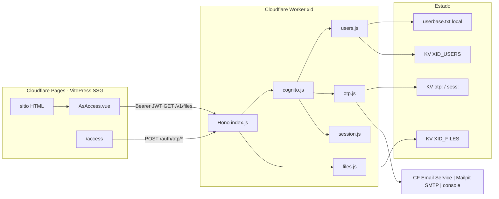
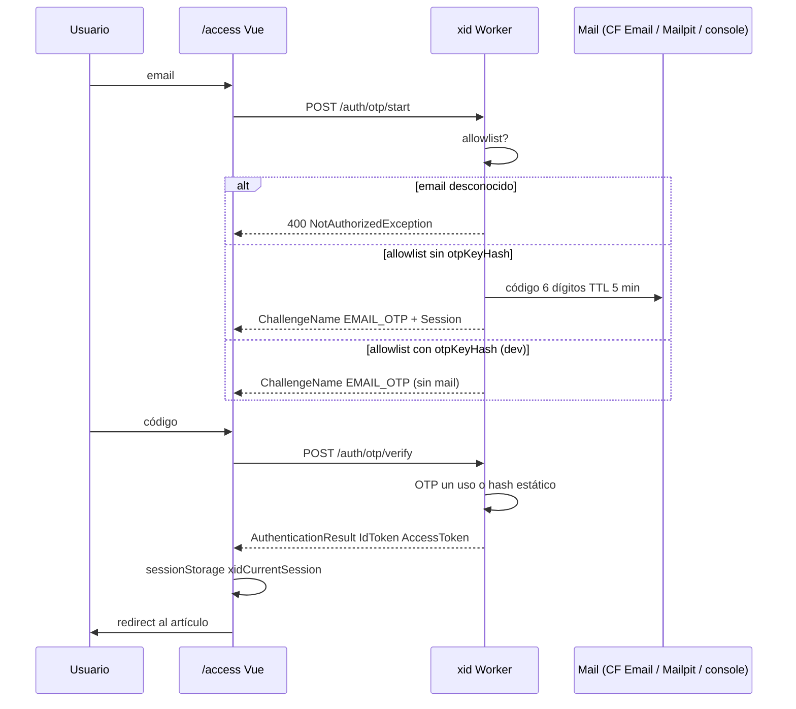
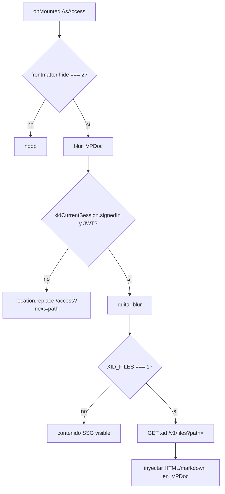

# OnMind-XID — eXpress User Identity for access (OTP) + file manager

> Alternativa expresa a **OnMind-UID** (otro proyecto robusto y privado) pensado para **OnMind-PUB** y **Cloudflare**

Sustituto de **Userbase** en [**OnMind-PUB**](): un Worker (Hono) con **API homologada con Cognito** (subconjunto) para autenticación por **OTP por email** contra una **allowlist**, más un **file manager** autenticado para artículos `hide: 2`.

- Corre local con **Bun** (→ SMTP **Mailpit**).
- Despliega como **Cloudflare Worker** (→ **Cloudflare Email Service** vía binding `send_email`).

---

## Arquitectura y decisiones clave

### Qué hace este paquete

1. **Autentica solo emails en allowlist** con **OTP por correo** (sin contraseñas).
2. Expone un **subconjunto de la API JSON de Cognito Identity Provider** (no AWS Cognito).
3. Sirve un **file manager** mínimo: `GET` de recursos de artículos `hide: 2` si hay sesión válida.
4. Sustituye Userbase en PUB (`PUB_XID`, `AsAccess.vue`, README, `task/initialize.js`).

> **Nota de seguridad:** El HTML estático en Cloudflare Pages sigue siendo público. El gate en cliente (blur/unblur) es el mismo modelo que Userbase, **arreglado**. El file API existe y `AsAccess` **puede** pedir el markdown/cuerpo a `xid` para inyectarlo (`XID_FILES=1`). Un follow-up puede convertir las páginas `hide: 2` en stubs y rellenar el cuerpo obligatoriamente desde el Worker.

### Decisiones de diseño

| # | Decisión | Rationale |
|---|----------|-----------|
| 1 | **Allowlist, no signup abierto** | Superficie mínima, sin spam de OTP a terceros. Alta = editar `userbase.txt` o escribir KV. |
| 2 | **Sin passwords** | Solo OTP de un uso (TTL ~5 min) o clave estática de **dev** `email:key` hasheada al cargar. |
| 3 | **Subconjunto Cognito, no AWS** | `POST /` con `X-Amz-Target` + alias `/auth/otp/*`. Ops: `InitiateAuth`, `RespondToAuthChallenge`, `GetUser`, `GlobalSignOut`. `SignUp` → 403. |
| 4 | **JWT HMAC (`XID_JWT_SECRET`), sin RefreshToken** | Access + Id (~1 h). Claims `sub` = email, `token_use` = `access` \| `id`. Menos estado; re-login OTP es barato. |
| 5 | **Doble canal de sesión** | Pages y Worker no comparten cookies. Vue guarda sesión en `sessionStorage.xidCurrentSession`. File API usa `Authorization: Bearer` + cookie `xid_session` HttpOnly en el Worker. |
| 6 | **Clave estática `email:key` solo en local** | Se hashea (SHA-256) al cargar; no se loguea. En prod `otpKeyHash` es opcional y **no** se sube desde dev. |
| 7 | **Mail: Cloudflare Email Service en prod; SMTP Mailpit en local** | Binding nativo `send_email` en Worker; SMTP a Mailpit (`localhost:1025`) en `bun run dev`. Fallback: stdout si `XID_ENV=dev`. |
| 8 | **Ficheros: FS local + KV `XID_FILES` en Worker; R2 después** | Un KV basta para unos pocos markdown `hide: 2`. |
| 9 | **`xid/` paquete hermano de `rag/`, no dentro del tema VitePress** | Runtime distinto (Worker vs SSG); wrangler propio. |
| 10 | **Hono `export default { fetch }`** | Un solo entrypoint para `bun --hot`, `wrangler dev` y deploy. |

### Arquitectura (mermaid)



### Flujo OTP (sequence)



### Runtime local vs Cloudflare

| | Local (`bun run dev`) | Worker |
|---|---|---|
| Usuarios | `userbase.txt` (FS) | KV `XID_USERS` |
| OTP / rate limit | `Map` in-memory **o** mismo KV si `wrangler dev` | KV prefix `otp:`, `rl:` |
| Ficheros | `XID_FILES_ROOT` (default `xid/files`) | KV `XID_FILES` (key = path) |
| Mail | SMTP Mailpit `XID_SMTP_HOST:XID_SMTP_PORT` (default `127.0.0.1:1025`, UI `:8025`); fallback stdout si `XID_ENV=dev` | binding `send_email` → Cloudflare Email Service (`env.MAIL.send()`); `wrangler dev` lo simula |
| Bindings | env `.env` / `xid/.dev.vars` | `wrangler.toml` + secrets |

> Detección: si existe `env.XID_USERS` (binding KV) → adapter KV; si no → txt.

### Gate PUB (tras el fix)



> `hide: 1` hoy **no** tiene gate en `AsAccess` (solo `=== 2`). El MVP no inventa semántica nueva para `hide: 1`: sidebar ya lo oculta; el cuerpo SSG sigue público. Follow-up si se quiere el mismo gate.

---

## Requisitos

- [Bun](https://bun.sh/) ≥ 1.3
- [Cloudflare Wrangler](https://developers.cloudflare.com/workers/wrangler/) (para `wrangler dev` / deploy)
- [Mailpit](https://mailpit.axllent.org/docs/) vía Docker (SMTP `:1025`, UI `:8025`) — recomendado para dev

```bash
bun install          # instala dependencias (hono)
```

---

## Inicio rápido (dev local)

```bash
cd xid
bun run dev          # → Bun.serve en http://localhost:8787
```

El servidor queda escuchando en **un solo puerto: `8787`** (o `PORT`). Sin servidor extra.

> ¿Por qué `src/dev.js`? Bun auto-sirve `export default { fetch }` (patrón Worker) en `3000`. Separamos el entrypoint: `src/index.js` es la app (export `fetch`, para Wrangler) y `src/dev.js` levanta `Bun.serve` explícito en `8787` (sin default export → un solo puerto).

### `userbase.txt` (allowlist local)

Crea `userbase.txt` (ver `userbase.txt.example`):

```
alice@example.com
bob@example.com:abc123        # :key estático dev (se hashea al cargar)
```

## Probar el flujo OTP

1. Arranca Mailpit (si no está): contenedor `axllent/mailpit` (SMTP `:1025`, UI `http://localhost:8025`).
2. Arranca el servicio: `bun run dev` (o `bun run start`).
3. `curl`:

```bash
# 1) start → devuelve Session (y Mailpit recibe el OTP)
curl -s -X POST http://localhost:8787/auth/otp/start -H 'Content-Type: application/json' \
  -d '{"email":"alice@example.com"}'

# 2) Mira el código en Mailpit UI (http://localhost:8025) o API:
curl -s http://localhost:8025/api/v1/messages

# 3) verify → AccessToken/IdToken
curl -s -X POST http://localhost:8787/auth/otp/verify -H 'Content-Type: application/json' \
  -d '{"session":"<Session>","email":"alice@example.com","code":"<6digits>"}'

# 4) perfil
curl -s http://localhost:8787/auth/me -H "Authorization: Bearer <AccessToken>"

# 5) logout
curl -s -X POST http://localhost:8787/auth/logout -H "Authorization: Bearer <AccessToken>"
```

Para un usuario con `email:key` (`bob@example.com:abc123`), `verify` acepta el key como código (dev).

### Health check

```bash
curl -s http://localhost:8787/health   # → {"ok":true,"env":"dev"}
```

## API (resumen)

| Ruta | Método | Descripción |
| --- | --- | --- |
| `POST /` | `X-Amz-Target: AWSCognitoIdentityProviderService.<Op>` | `InitiateAuth`, `RespondToAuthChallenge`, `GetUser`, `GlobalSignOut`, `SignUp`(403) |
| `POST /auth/otp/start` | alias InitiateAuth | body `{ email }` |
| `POST /auth/otp/verify` | alias RespondToAuthChallenge | body `{ session, email, code }` |
| `GET /auth/me` | alias GetUser | Bearer |
| `POST /auth/logout` | alias GlobalSignOut | Bearer |
| `GET /v1/files?path=docs/secret.md` | file manager | Bearer |
| `GET /files/*` | file manager | Bearer |
| `GET /health` | health | — |

Errores: `400`/`403` + `{ "__type": "<Exception>", "message": "..." }` (shape Cognito).

## Ficheros (dev local)

Por defecto lee de `files/` bajo `xid/` (raíz configurable con `XID_FILES_ROOT`). El guard de path rechaza `..`.

```bash
mkdir -p files/docs
echo '# Secreto' > files/docs/secret.md
curl -s http://localhost:8787/v1/files?path=docs/secret.md -H "Authorization: Bearer <AccessToken>"
```

## Variables de entorno

| Variable | Uso |
| --- | --- |
| `PORT` | puerto local (default `8787`) |
| `XID_JWT_SECRET` | ≥ 32 bytes; si falta en dev se genera uno efímero |
| `XID_MAIL_FROM` | remitente (ej. `noreply@mx.tudominio.com`) |
| `XID_SMTP_HOST` / `XID_SMTP_PORT` | SMTP dev (default `127.0.0.1:1025` → Mailpit) |
| `XID_CORS_ORIGINS` | allowlist CORS comma-separated |
| `XID_CLIENT_ID` | string opaco (default `pub-xid`) |
| `XID_USERS_TXT` | ruta alternativa a `userbase.txt` |
| `XID_FILES_ROOT` | root local de ficheros (default `./files`) |
| `XID_ENV` | `dev` (consola fallback) \| `production` |

## Deploy Cloudflare (resumen)

```bash
cd xid
npx wrangler kv namespace create XID_META      # pegar IDs en wrangler.toml
npx wrangler kv namespace create XID_USERS
npx wrangler kv namespace create XID_FILES
npx wrangler secret put XID_JWT_SECRET         # openssl rand -hex 32
npx wrangler secret put XID_MAIL_FROM
npx wrangler secret put XID_CORS_ORIGINS
bun scripts/bootstrap-kv.js --apply            # userbase.txt → KV XID_USERS (sin --include-dev-keys en prod)
npx wrangler deploy
```

Requisito de envío: dominio onboardado en **Cloudflare Email Service** (SPF/DKIM/DMARC) y cuenta Workers en plan **Paid** para destinatarios arbitrarios.

## Integración PUB

En `sites/<sitio>/.env`:

```
PUB_XID=1
XID_URL=http://localhost:8787      # o el Worker desplegado
XID_CLIENT_ID=pub-xid
XID_FILES=0
```

`AsAccess.vue` desbloquea `hide: 2` con sesión; sin sesión redirige a `/access?next=`. `XID_FILES=1` también trae el cuerpo al Worker.

---

## Estado

Implementado y verificado en local (Bun + Mailpit): flujo OTP end-to-end, tokens JWT, `/auth/me`, files (200/401/404/traversal 400), CORS, build PUB con `PUB_XID=1`. **Pendiente** la configuración de deploy (Cloudflare Email, KV IDs, secrets).