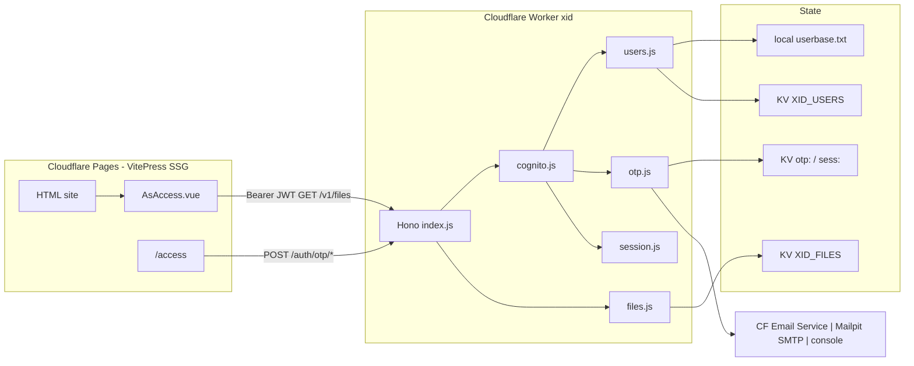
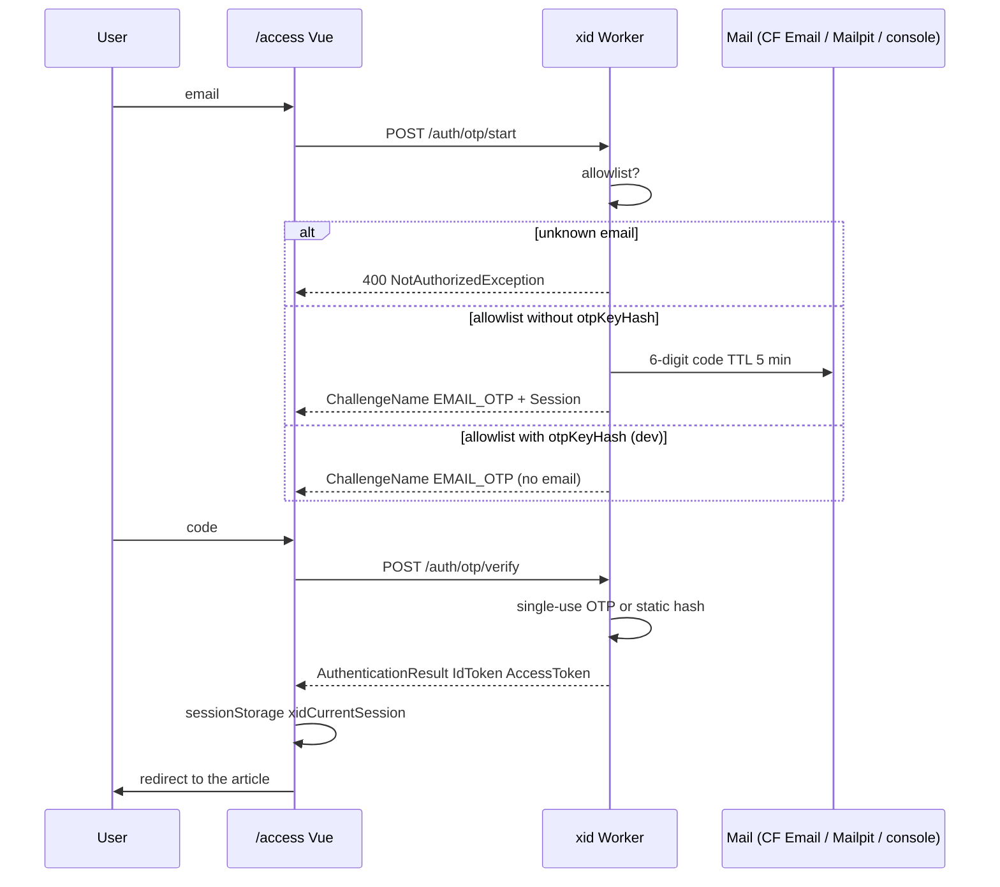
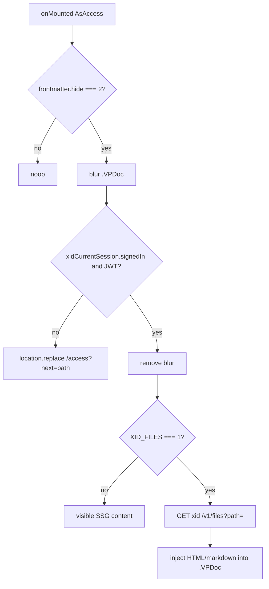

# OnMind-XID — eXpress IDentity for access

> A simple alternative to **OnMind-UID** (another private project) designed mainly for [**OnMind-PUB**](https://github.com/kaesar/onmind-pub) and **Cloudflare** (containers as alternative).

This is an **IdP/IAM** for [**OnMind-PUB**](https://github.com/kaesar/onmind-pub). Thinked as worker (in **Hono**) with a **Cognito-compatible API** (subset, even **Entra ID compatible**) for **email OTP** authentication against an **allowlist**, plus an authenticated **file manager** for `hide: 2` articles. Besides could be used with WebApps, AI and machine to machine (M2M/B2B) for API's.

- Runs locally with **Bun** (to test use **Mailpit** for SMTP).
- Deploys as a **Cloudflare Worker** (and **Cloudflare Email Service** via the `send_email` binding).

---

## Architecture and key decisions

### What this package does

1. **Authenticates only allowlisted emails** with **email OTP** (no passwords).
2. Exposes a **subset of the Cognito Identity Provider JSON API** (not AWS Cognito).
3. Serves a minimal **file manager**: `GET` of `hide: 2` article assets with a valid session.
4. Replaces Userbase in PUB (`PUB_XID`, `AsAccess.vue`, README, `task/initialize.js`).

> **Security note:** Static HTML on Cloudflare Pages is still public. The client-side gate (blur/unblur) is the same Userbase model, **fixed**. The file API exists and `AsAccess` **can** fetch the markdown/body from `xid` to inject it (`XID_FILES=1`). A follow-up may turn `hide: 2` pages into stubs and always fill the body from the Worker.

### Design decisions

| # | Decision | Rationale |
|---|----------|-----------|
| 1 | **Allowlist, no open signup** | Minimal surface, no OTP spam to third parties. Onboarding = editing `userbase.txt` or writing KV. |
| 2 | **No passwords** | Single-use OTP only (TTL ~5 min) or **dev**-only static `email:key` hashed on load. |
| 3 | **Cognito subset, not AWS** | `POST /` with `X-Amz-Target` + `/auth/otp/*` aliases. Ops: `InitiateAuth`, `RespondToAuthChallenge`, `GetUser`, `GlobalSignOut`. `SignUp` for 403. |
| 4 | **HMAC JWT (`XID_JWT_SECRET`), no RefreshToken** | Access + Id (~1 h). Claims `sub` = email, `token_use` = `access` \| `id`. Less state; OTP re-login is cheap. |
| 5 | **Dual session channel** | Pages and the Worker don't share cookies. Vue stores the session in `sessionStorage.xidCurrentSession`. The file API uses `Authorization: Bearer` + an HttpOnly `xid_session` cookie on the Worker. |
| 6 | **Static `email:key` for local only** | Hashed (SHA-256) on load; never logged. In prod `otpKeyHash` is optional and is **not** uploaded from dev. |
| 7 | **Mail: Cloudflare Email Service in prod; Mailpit SMTP locally** | Native `send_email` binding on the Worker; SMTP to Mailpit (`localhost:1025`) in `bun run dev`. Fallback: stdout if `XID_ENV=dev`. |
| 8 | **Files: local FS + `XID_FILES` KV on the Worker; R2 later** | One KV is enough for a few `hide: 2` markdown files. |
| 9 | **`xid/` as a sibling package of `rag/`, not inside the VitePress theme** | Different runtime (Worker vs SSG); its own wrangler. |
| 10 | **Hono `export default { fetch }`** | A single entrypoint for `bun --hot`, `wrangler dev`, and deploy. |

### Architecture (mermaid)



### OTP flow (sequence)



### Local vs Cloudflare runtime

| | Local (`bun run dev`) | Worker |
|---|---|---|
| Users | `userbase.txt` (FS) | KV `XID_USERS` |
| OTP / rate limit | In-memory `Map` **or** the same KV under `wrangler dev` | KV prefix `otp:`, `rl:` |
| Files | `XID_FILES_ROOT` (default `xid/files`) | KV `XID_FILES` (key = path) |
| Mail | Mailpit SMTP `XID_SMTP_HOST:XID_SMTP_PORT` (default `127.0.0.1:1025`, UI `:8025`); stdout fallback if `XID_ENV=dev` | `send_email` binding with Cloudflare Email Service (`env.MAIL.send()`); `wrangler dev` simulates it |
| Bindings | `.env` / `xid/.dev.vars` env | `wrangler.toml` + secrets |

> Detection: if the `env.XID_USERS` binding (KV) exists uses KV adapter, otherwise uses txt.

### PUB gate (after the fix)



> `hide: 1` currently has **no** gate in `AsAccess` (only `=== 2`). The MVP doesn't invent new semantics for `hide: 1`: the sidebar already hides it; the SSG body stays public. Follow-up if the same gate is wanted.

---

## Requirements

- [Bun](https://bun.sh/) ≥ 1.3
- [Cloudflare Wrangler](https://developers.cloudflare.com/workers/wrangler/) (for `wrangler dev` / deploy)
- [Mailpit](https://mailpit.axllent.org/docs/) via Docker (SMTP `:1025`, UI `:8025`) — recommended for dev

```bash
bun install          # installs dependencies (hono)
```

---

## Quick start (local dev)

```bash
cd xid
bun run dev          # Bun.serve on http://localhost:8787
```

The server listens on **a single port: `8787`** (or `PORT`). No extra server.

> Why `src/dev.js`? Bun auto-serves `export default { fetch }` (Worker pattern) on `3000`. We split the entrypoint: `src/index.js` is the app (exports `fetch`, for Wrangler) and `src/dev.js` starts an explicit `Bun.serve` on `8787` (no default export, a single port).

### `userbase.txt` (local allowlist)

Create `userbase.txt` (see `userbase.txt.example`):

```
alice@example.com
bob@example.com:abc123        # static dev :key (hashed on load)
```

## Testing the OTP flow

1. Start Mailpit (if not running): `axllent/mailpit` container (SMTP `:1025`, UI `http://localhost:8025`).
2. Start the service: `bun run dev` (or `bun run start`).
3. `curl`:

```bash
# 1) start - returns Session (and Mailpit receives the OTP)
curl -s -X POST http://localhost:8787/auth/otp/start -H 'Content-Type: application/json' \
  -d '{"email":"alice@example.com"}'

# 2) Check the code in the Mailpit UI (http://localhost:8025) or API:
curl -s http://localhost:8025/api/v1/messages

# 3) verify - AccessToken/IdToken
curl -s -X POST http://localhost:8787/auth/otp/verify -H 'Content-Type: application/json' \
  -d '{"session":"<Session>","email":"alice@example.com","code":"<6digits>"}'

# 4) profile
curl -s http://localhost:8787/auth/me -H "Authorization: Bearer <AccessToken>"

# 5) logout
curl -s -X POST http://localhost:8787/auth/logout -H "Authorization: Bearer <AccessToken>"
```

For a user with `email:key` (`bob@example.com:abc123`), `verify` accepts the key as the code (dev).

### Health check

```bash
curl -s http://localhost:8787/health
```

> Returns: `{"ok":true,"env":"dev"}`

## API (summary)

| Path | Method | Description |
| --- | --- | --- |
| `POST /` | `X-Amz-Target: AWSCognitoIdentityProviderService.<Op>` | `InitiateAuth`, `RespondToAuthChallenge`, `GetUser`, `GlobalSignOut`, `SignUp`(403) |
| `POST /auth/otp/start` | InitiateAuth alias | body `{ email }` |
| `POST /auth/otp/verify` | RespondToAuthChallenge alias | body `{ session, email, code }` |
| `GET /auth/me` | GetUser alias | Bearer |
| `POST /auth/logout` | GlobalSignOut alias | Bearer |
| `POST /oauth2/token` | hosted-UI style `client_credentials` (B2B) | Basic or body `client_id`+`client_secret` |
| `GET /v1/files?path=docs/secret.md` | file manager | Bearer |
| `GET /files/*` | file manager | Bearer |
| `GET /health` | health | — |

Errors: `400`/`403` + `{ "__type": "<Exception>", "message": "..." }` (Cognito shape).

## Entra ID facade (OIDC simulation, alternative to Cognito)

Same core (allowlist + OTP + file manager), second facade: **OAuth2 v2.0 + OIDC discovery**
compatible with generic OIDC clients and MSAL. Verified end-to-end locally
(discovery → `authorize` OTP → `token` with PKCE S256 → `userinfo` → rotating `refresh`).

| Path | Method | Description |
| --- | --- | --- |
| `/.well-known/openid-configuration` | `GET` | default tenant discovery |
| `/{tenant}/v2.0/.well-known/openid-configuration` | `GET` | discovery (`common`/`organizations`/`consumers`, configured `tid`) |
| `/{tenant}/oauth2/v2.0/authorize` | `GET`+`POST` | email form send code, and OTP code form returns `302 redirect_uri?code=&state=` |
| `/{tenant}/oauth2/v2.0/token` | `POST` | `grant_type=authorization_code` (with `code_verifier` if PKCE was used) or `refresh_token` (rotation, single use) |
| `/{tenant}/discovery/v2.0/keys` | `GET` | JWKS (`RS256`, stable `kid` in prod) |
| `/{tenant}/openid/userinfo` | `GET` | Bearer claims (`sub`=email, `oid`, `tid`, `preferred_username`) |
| `/{tenant}/oauth2/v2.0/logout` | `GET` | revokes `jti` (denylist); `302 post_logout_redirect_uri?state=` if requested |

Notes:

- Entra tokens are signed **RS256** (`XID_RSA_PRIVATE_JWK`; ephemeral pair in dev). Cognito ones
  stay HS256. `userinfo` accepts both; `GET /v1/files` accepts both (`sub`=email).
- Interactive flow = public clients (no secret; ignored if sent). B2B = `client_credentials`
  with secret (see below). PKCE `S256` is optional but verified if sent.
- MSAL.js: custom authority `https://<xid-host>/<tenant>` with
  `knownAuthorities: ["<xid-host>"]` + `validateAuthority: false`.
- In dev `redirect_uri`/`post_logout_redirect_uri` are open; in prod
  `XID_REDIRECT_ALLOWLIST` is required.
- Login UI is bilingual (English default): `ui_locales=es` OIDC param or
  `Accept-Language` header selects Spanish.

## B2B machine-to-machine (`client_credentials`, `client_id`-managed)

Pure service-to-service without users or OTP, on both facades over one shared registry
(`src/clients.js`): local `clients.txt` with rows `client_id:client_secret:scope1,scope2`
(see `clients.txt.example`), KV `XID_CLIENTS` in prod (**hashes only**, never plaintext secrets).

```bash
echo 'svc-billing:$(openssl rand -base64 32):files.read' >> clients.txt
curl -s -X POST http://localhost:8787/oauth2/token \
  -u svc-billing:<secret> --data-urlencode 'grant_type=client_credentials'
```

> Returns: `{"access_token":"eyJ...","expires_in":3600,"token_type":"Bearer","scope":"files.read"}`

| Path | Grant | Auth | Response |
| --- | --- | --- | --- |
| `POST /oauth2/token` (Cognito shape) | `client_credentials` | `Basic` or body | `{access_token, expires_in, token_type, scope}`; errors `{error, error_description}` (+ `WWW-Authenticate` on 401) |
| `POST /{tenant}/oauth2/v2.0/token` (Entra shape) | `client_credentials` | `Basic` or body | `{access_token, expires_in, token_type, scope}` (no `id_token`/`refresh_token`) |

**Notes**:

- Machine tokens are **RS256**, `sub` = `client_id` (+ `client_id`, `token_use=access`, `scp`/`scope`), ~1 h.
  `GET /v1/files` accepts them only with the `files.read` scope **and** a registered client
  holding it (user allowlist path unchanged); `userinfo` rejects them (no user identity).
- Requested `scope` must be a subset of the client's grant (`invalid_scope` otherwise);
  omitting `scope` grants the full set. Logout revokes via `jti` denylist, same as users.
- Brute-force guard: rate limit per `client_id` + IP on both token endpoints.

## Files (local dev)

By default it reads from `files/` under `xid/` (root configurable via `XID_FILES_ROOT`). The path guard rejects `..`.

```bash
mkdir -p files/docs
echo '# Secret' > files/docs/secret.md
curl -s http://localhost:8787/v1/files?path=docs/secret.md -H "Authorization: Bearer <AccessToken>"
```

## Environment variables

| Variable | Usage |
| --- | --- |
| `PORT` | local port (default `8787`) |
| `XID_JWT_SECRET` | ≥ 32 bytes, if missing in dev an ephemeral one is generated, else: `export XID_JWT_SECRET=$(openssl rand -hex 32)` |
| `XID_MAIL_FROM` | sender (e.g. `noreply@mx.tudominio.com`) |
| `XID_SMTP_HOST` / `XID_SMTP_PORT` | dev SMTP (default `127.0.0.1:1025` for Mailpit) |
| `XID_CORS_ORIGINS` | comma-separated CORS allowlist |
| `XID_CLIENT_ID` | opaque string (default `pub-xid`) |
| `XID_USERS_TXT` | alternative path to `userbase.txt` |
| `XID_CLIENTS_TXT` | alternative path to `clients.txt` |
| `XID_FILES_ROOT` | local files root (default `./files`) |
| `XID_ENV` | `dev` (console fallback) \| `production` |
| `XID_RSA_PRIVATE_JWK` | RSA private JWK (`bun scripts/gen-rsa-jwk.js`); ephemeral in dev if missing |
| `XID_TENANT_ID` | `tid` for `common`/`organizations`/`consumers` (default `xid`) |
| `XID_REDIRECT_ALLOWLIST` | allowed `redirect_uri`/`post_logout_redirect_uri` (comma-separated, trailing `*` = prefix); open in dev if empty, denied in prod |

## Cloudflare deploy (summary)

```bash
cd xid
export XID_JWT_SECRET=$(openssl rand -hex 32)
npx wrangler kv namespace create XID_META      # paste IDs into wrangler.toml
npx wrangler kv namespace create XID_USERS
npx wrangler kv namespace create XID_FILES
npx wrangler kv namespace create XID_CLIENTS
npx wrangler secret put XID_JWT_SECRET         # openssl rand -hex 32
bun scripts/gen-rsa-jwk.js --kid xid-1 > jwk.json  # do NOT version
npx wrangler secret put XID_RSA_PRIVATE_JWK < jwk.json && rm jwk.json
npx wrangler secret put XID_MAIL_FROM
npx wrangler secret put XID_CORS_ORIGINS
bun scripts/bootstrap-kv.js --apply            # userbase.txt: KV XID_USERS (without --include-dev-keys in prod)
bun scripts/bootstrap-clients.js --apply       # clients.txt: KV XID_CLIENTS (hashes only, never secrets)
npx wrangler kv key put --binding=XID_FILES "cui/onmind-cui-v3.js" --path vendor/cui/onmind-cui-v3.js  # login bundle (public)
npx wrangler deploy
```

Sending requirement: domain onboarded in **Cloudflare Email Service** (SPF/DKIM/DMARC) and a **Paid** Workers plan for arbitrary recipients.

## Docker (containers / VMs, no Cloudflare)

Without KV the file adapters apply (`userbase.txt`/`clients.txt`, `XID_FILES_ROOT`)
and OTP/rate-limit/code state lives in memory.

```bash
cd xid
docker build -t onmind-xid .

mkdir -p /srv/xid/files/docs
printf 'alice@example.com\n' > /srv/xid/userbase.txt
printf 'svc-billing:$(openssl rand -base64 32):files.read\n' > /srv/xid/clients.txt

docker run -d --name xid -p 8787:8787 \
  -v /srv/xid:/data \
  -e XID_JWT_SECRET=$(openssl rand -hex 32) \
  -e XID_SMTP_HOST=mailpit -e XID_SMTP_PORT=1025 \
  -e XID_MAIL_FROM=noreply@example.com \
  -e XID_CORS_ORIGINS=https://tu-sitio.com \
  -e XID_REDIRECT_ALLOWLIST=https://tu-sitio.com/callback \
  onmind-xid
curl -s http://localhost:8787/health
```

Compose equivalent:

```yaml
services:
  xid:
    build: .
    ports: ["8787:8787"]
    volumes: ["/srv/xid:/data"]
    environment:
      XID_JWT_SECRET: ${XID_JWT_SECRET:?required}
      XID_SMTP_HOST: mailpit
      XID_MAIL_FROM: noreply@example.com
      XID_CORS_ORIGINS: https://tu-sitio.com
```

Notes: the image defaults to `XID_ENV=production` with FS paths under `/data`
(override via env); with `production` OTP email requires a reachable SMTP —
static `email:key` users skip mail (dev only). Secrets via env/vault, never baked in.

## OnMind-PUB integration

For [**OnMind-PUB**](https://github.com/kaesar/onmind-pub), in `sites/<site>/.env` includes the following:

```
PUB_XID=1
XID_URL=http://localhost:8787
XID_CLIENT_ID=pub-xid
XID_FILES=0
```

> `AsAccess.vue` unlocks `hide: 2` with a session. Without a session it redirects to `/access?next=`.  
> `XID_FILES=1` also fetches the body to the Worker. `XID_URL` could be the deployed worker address.

---

## Status

Implemented and verified locally (Bun + Mailpit): end-to-end OTP flow, JWT tokens, `/auth/me`, files (200/401/404/traversal 400), CORS, PUB build with `PUB_XID=1`. Reproducible smoke suite: `bun run smoke` (25 checks in-process, no ports). Deploy configuration still **pending** (Cloudflare Email, KV IDs, secrets).
