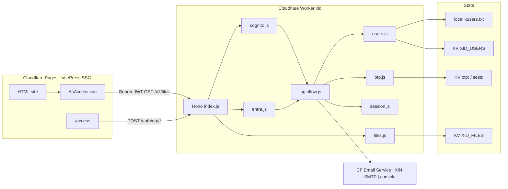
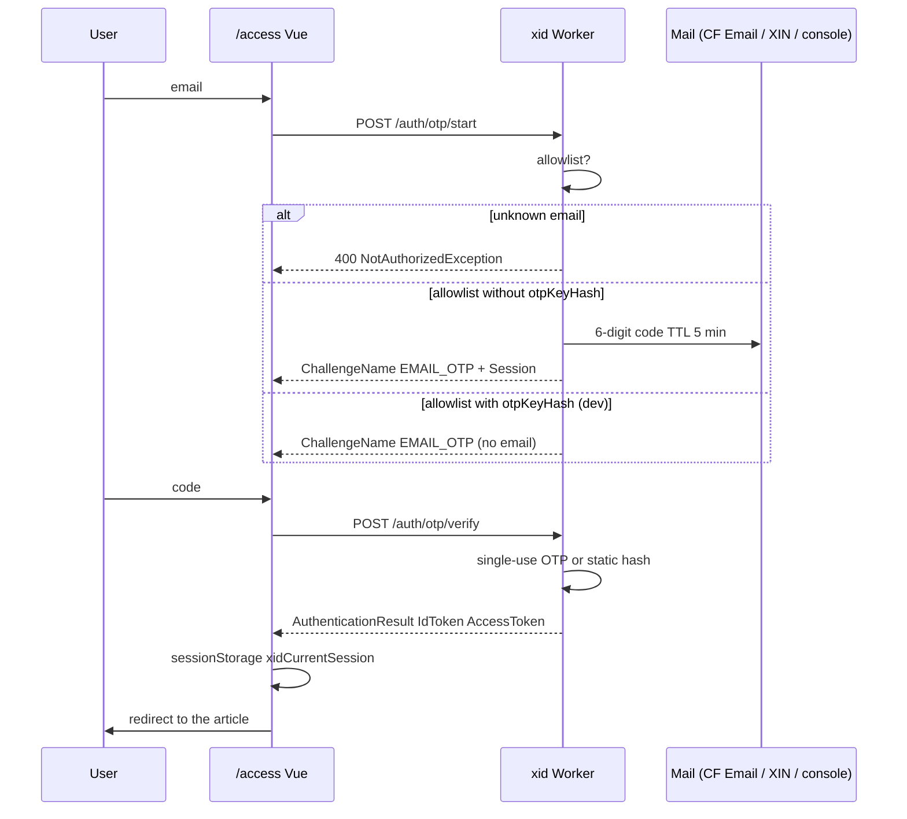
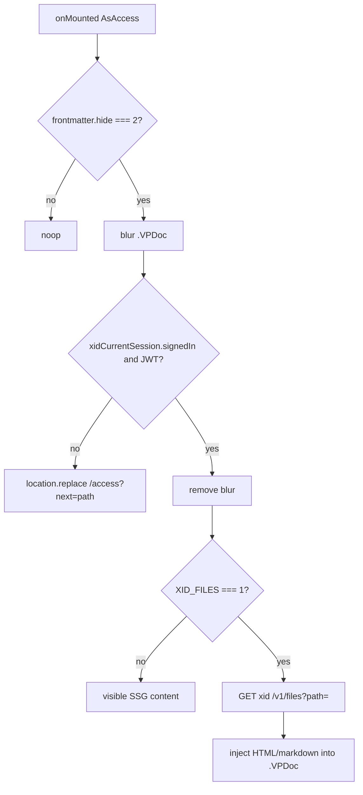

# OnMind-XID — eXpress IDentity for access

> A simple alternative to **OnMind-UID** (another private project) designed mainly for [**OnMind-PUB**](https://github.com/kaesar/onmind-pub) and **Cloudflare** (containers and AWS Lambda as alternatives).

This is an **IdP/IAM** for [**OnMind-PUB**](https://github.com/kaesar/onmind-pub). Thinked as worker (in **Hono**) with a **Cognito-compatible API** (subset, even **Entra ID compatible**) for **email OTP** authentication against an **allowlist**, plus an authenticated **file manager** for `hide: 2` articles. Besides could be used with WebApps, AI and machine to machine (M2M/B2B) for API's.

- Runs locally with **Bun** (for mail in dev use **[OnMind-XIN](https://github.com/kaesar/onmind-xin)**, sibling `../xin`, over SMTP).
- Deploys as a **Cloudflare Worker** (and **Cloudflare Email Service** via the `send_email` binding).
- Deploys to **AWS Lambda** (Node.js ≥ 20) with **DynamoDB** as an alternative runtime
  (Function URL or API Gateway; OTP mail not configured yet → password-only).

Same Hono core everywhere; only the entrypoint and the bindings differ:

| Runtime | Entrypoint | Storage bindings | Mail |
| --- | --- | --- | --- |
| Local / container (Bun) | `src/dev.js` → `Bun.serve` | none → txt (`xusers.txt`/`xclients.txt`) + in-memory `Map` + FS | SMTP (XIN :1025) or XIN HTTP (`XID_XIN_URL`) / console in dev |
| Cloudflare Worker | `src/index.js` → `export default { fetch }` (`wrangler deploy`) | KV `XID_META`/`XID_USERS`/`XID_CLIENTS`/`XID_FILES` | Cloudflare Email Service (`send_email`) |
| AWS Lambda | `src/lambda.js` → `src/lambda.handler` (Function URL / API GW v2) | DynamoDB `xmeta`/`xusers`/`xclients` (`XID_*_TABLE`, `XID_DYNAMO_ENDPOINT` for LocalStack/dynamodb-local) | XIN HTTP (`XID_XIN_URL`) · else password login only |

---

## Architecture and key decisions

### What this package does

1. **Authenticates only allowlisted emails** with **email OTP** (passwordless by default; optional real bcrypt password per user with OTP kept as fallback).
2. Exposes a **subset of the Cognito Identity Provider JSON API** (not AWS Cognito).
3. Serves a minimal **file manager**: `GET` of `hide: 2` article assets with a valid session.
4. Replaces Userbase in PUB (`PUB_XID`, `AsAccess.vue`, README, `task/initialize.js`).

> **Security note:** Static HTML on Cloudflare Pages is still public. The client-side gate (blur/unblur) is the same Userbase model, **fixed**. The file API exists and `AsAccess` **can** fetch the markdown/body from `xid` to inject it (`XID_FILES=1`). A follow-up may turn `hide: 2` pages into stubs and always fill the body from the Worker.

### Design decisions

| # | Decision | Rationale |
|---|----------|-----------|
| 1 | **Allowlist, no open signup** | Minimal surface, no OTP spam to third parties. Onboarding = editing `xusers.txt` or writing KV. |
| 2 | **Passwordless first, optional real password** | Single-use OTP (TTL ~5 min) by default; optional bcrypt `email:$2b$` password (TinyAuth-compatible) with OTP fallback; legacy **dev**-only static `email:key` (SHA-256 on load). |
| 3 | **Cognito subset, not AWS** | `POST /` with `X-Amz-Target` + `/auth/otp/*` aliases. Ops: `InitiateAuth`, `RespondToAuthChallenge`, `GetUser`, `GlobalSignOut`. `SignUp` for 403. |
| 4 | **HMAC JWT (`XID_JWT_SECRET`) + RefreshToken opaco** | Access + Id (~1 h). Claims `sub` = email, `token_use` = `access` \| `id`. Refresh opaco (256 bits, 30 d deslizantes, un solo uso con rotación); `GlobalSignOut` revoca access (`jti` denylist) y todos los refresh del usuario. |
| 5 | **Dual session channel** | Pages and the Worker don't share cookies. Vue stores the session in `sessionStorage.xidCurrentSession`. The file API uses `Authorization: Bearer` + an HttpOnly `xid_session` cookie on the Worker. |
| 6 | **Static `email:key` for local only** | Hashed (SHA-256) on load; never logged. In prod `otpKeyHash` is optional and is **not** uploaded from dev. |
| 7 | **Mail: Cloudflare Email Service in prod; OnMind-XIN locally and on Lambda** | Native `send_email` binding on the Worker; SMTP to XIN (`localhost:1025`) — or HTTP via `XID_XIN_URL` (`POST /send`, the Lambda path) — in dev. Fallback: stdout if `XID_ENV=dev`. |
| 8 | **Files: local FS + `XID_FILES` KV on the Worker; R2 later** | One KV is enough for a few `hide: 2` markdown files. |
| 9 | **`xid/` as a sibling package of `rag/`, not inside the VitePress theme** | Different runtime (Worker vs SSG); its own wrangler. |
| 10 | **Hono `export default { fetch }`** | A single entrypoint for `bun --hot`, `wrangler dev`, and deploy. |

### Architecture (mermaid)


```mermaid
flowchart LR
  subgraph pages [Cloudflare Pages - VitePress SSG]
    Site[HTML site]
    AsAccess[AsAccess.vue]
    Access["/access"]
  end
  subgraph worker [Cloudflare Worker xid]
    Hono[Hono index.js]
    Cog[cognito.js]
    Entra[entra.js]
    Flow[loginflow.js]
    Users[users.js]
    OTP[otp.js]
    Files[files.js]
    Sess[session.js]
  end
  subgraph store [State]
    Txt[local xusers.txt]
    KVU[KV XID_USERS]
    KVO["KV otp: / sess:"]
    KVF[KV XID_FILES]
  end
  Mail["CF Email Service | XIN SMTP | console"]
  Site --> AsAccess
  Access -->|POST /auth/otp/*| Hono
  AsAccess -->|Bearer JWT GET /v1/files| Hono
  Hono --> Cog
  Hono --> Entra
  Hono --> Files
  Cog --> Flow
  Entra --> Flow
  Flow --> Users
  Flow --> OTP
  Flow --> Sess
  Flow --> Mail
  Users --> Txt
  Users --> KVU
  OTP --> KVO
  Files --> KVF
```

### OTP flow (sequence)


```mermaid
sequenceDiagram
  participant U as User
  participant A as /access Vue
  participant W as xid Worker
  participant M as Mail (CF Email / XIN / console)
  U->>A: email
  A->>W: POST /auth/otp/start
  W->>W: allowlist?
  alt unknown email
    W-->>A: 400 NotAuthorizedException
  else allowlist without otpKeyHash
    W->>M: 6-digit code TTL 5 min
    W-->>A: ChallengeName EMAIL_OTP + Session
  else allowlist with otpKeyHash (dev)
    W-->>A: ChallengeName EMAIL_OTP (no email)
  end
  U->>A: code
  A->>W: POST /auth/otp/verify
  W->>W: single-use OTP or static hash
  W-->>A: AuthenticationResult IdToken AccessToken
  A->>A: sessionStorage xidCurrentSession
  A->>U: redirect to the article
```

### Local vs Cloudflare runtime

| | Local (`bun run dev`) | Worker |
|---|---|---|
| Users | `xusers.txt` (FS) | KV `XID_USERS` |
| OTP / rate limit | In-memory `Map` **or** the same KV under `wrangler dev` | KV prefix `otp:`, `rl:` |
| Files | `XID_FILES_ROOT` (default `xid/files`) | KV `XID_FILES` (key = path) |
| Mail | Send via XIN: SMTP `XID_SMTP_HOST:XID_SMTP_PORT` (default `127.0.0.1:1025`) or HTTP `XID_XIN_URL` (`POST /send`, required on Lambda); read the OTP via the XIN HTTP API (`GET :8788/messages` — run XIN with `PORT=8788` so it doesn't clash with XID's `:8787`); stdout fallback if `XID_ENV=dev` | `send_email` binding with Cloudflare Email Service (`env.MAIL.send()`); `wrangler dev` simulates it |
| Bindings | `.env` / `xid/.dev.vars` env | `wrangler.toml` + secrets |

> Detection: if the `env.XID_USERS` binding (KV) exists uses KV adapter, otherwise uses txt.

### PUB gate (after the fix)


```mermaid
flowchart TD
  M[onMounted AsAccess] --> H{frontmatter.hide === 2?}
  H -->|no| End[noop]
  H -->|yes| Blur[blur .VPDoc]
  Blur --> S{xidCurrentSession.signedIn and JWT?}
  S -->|no| Go["location.replace /access?next=path"]
  S -->|yes| Unblur[remove blur]
  Unblur --> F{XID_FILES === 1?}
  F -->|no| End2[visible SSG content]
  F -->|yes| Get["GET xid /v1/files?path="]
  Get --> Inj[inject HTML/markdown into .VPDoc]
```

> `hide: 1` currently has **no** gate in `AsAccess` (only `=== 2`). The MVP doesn't invent new semantics for `hide: 1`: the sidebar already hides it; the SSG body stays public. Follow-up if the same gate is wanted.

---

## Requirements

- [Bun](https://bun.sh/) ≥ 1.3
- [Cloudflare Wrangler](https://developers.cloudflare.com/workers/wrangler/) (for `wrangler dev` / deploy)
- [OnMind-XIN](https://github.com/kaesar/onmind-xin) (sibling `../xin`): from there `PORT=8788 bun run dev` (SMTP `:1025`, HTTP API `:8788`) — recommended for dev

```bash
bun install          # installs dependencies (hono)
```

---

## Quick start (local dev)

```bash
cd xid
bun run dev          # Bun.serve on http://localhost:8787
```

The server listens on **a single port: `8787`** (or `PORT`). No extra server.

> Why `src/dev.js`? Bun auto-serves `export default { fetch }` (Worker pattern) on `3000`. We split the entrypoint: `src/index.js` is the app (exports `fetch`, for Wrangler) and `src/dev.js` starts an explicit `Bun.serve` on `8787` (no default export, a single port).

### `xusers.txt` (local allowlist)

Create `xusers.txt` (see `xusers.txt.example`):

```
alice@example.com                                   # OTP by email only
bob@example.com:$2b$10$...                          # real password (bcrypt, TinyAuth-compatible)
carol@example.com:staticdev                         # legacy static dev key (SHA-256 on load)
```

- `email` alone → passwordless email OTP (production path).
- `email:$2b$…` → real password login (Cognito `PASSWORD` challenge, authorize
  `mode=password`) with email OTP kept as fallback. Generate with
  `bun run cli user password <email>` (never stored in clear).
- `email:key` → legacy static dev key accepted as the OTP code (dev only).

## Testing the OTP flow

1. Start XIN (if not running): from `../xin`, `PORT=8788 bun run dev` (SMTP `:1025`, API `http://localhost:8788`).
2. Start the service: `bun run dev` (or `bun run start`).
3. `curl`:

```bash
# 1) start - returns Session (and XIN stores the OTP)
curl -s -X POST http://localhost:8787/auth/otp/start -H 'Content-Type: application/json' \
  -d '{"email":"alice@example.com"}'

# 2) Read the code from XIN (the OTP is in `text`):
curl -s 'http://localhost:8788/messages?limit=1'

# 3) verify - AccessToken/IdToken
curl -s -X POST http://localhost:8787/auth/otp/verify -H 'Content-Type: application/json' \
  -d '{"session":"<Session>","email":"alice@example.com","code":"<6digits>"}'

# 4) profile
curl -s http://localhost:8787/auth/me -H "Authorization: Bearer <AccessToken>"

# 5) logout
curl -s -X POST http://localhost:8787/auth/logout -H "Authorization: Bearer <AccessToken>"
```

For a user with `email:key` (`bob@example.com:abc123`), `verify` accepts the key as the code (dev).

## Testing the password flow (no mail needed)

`start` con `password` no genera ni envía OTP: funciona sin SMTP (útil en
despliegues sin relay, p. ej. contenedor en Azure).

```bash
# 1) start - devuelve Session sin enviar correo
curl -s -X POST http://localhost:8787/auth/otp/start -H 'Content-Type: application/json' \
  -d '{"email":"bob@example.com","password":"<secret>"}'
# → {"ChallengeName":"EMAIL_OTP","Session":"<Session>","ChallengeParameters":{"USERNAME":"...","PASSWORD_ENABLED":"true"}}

# 2) verify - AccessToken/IdToken
curl -s -X POST http://localhost:8787/auth/otp/verify -H 'Content-Type: application/json' \
  -d '{"session":"<Session>","email":"bob@example.com","password":"<secret>"}'
```

- Sin `password` en `start` → rama OTP clásica (envía correo; en `production`
  sin SMTP responde 500).
- `start` con `password` para un usuario sin hash → `Password login not enabled`.

## Refresh flow (fachada Cognito)

Cada login devuelve además `RefreshToken` (opaco, 30 días deslizantes).
`POST /auth/refresh {"refreshToken"}` (o `InitiateAuth` con
`AuthFlow: REFRESH_TOKEN_AUTH`) devuelve un `AuthenticationResult` nuevo y
rota el refresh (el anterior queda inválido). `GlobalSignOut` revoca el access
y todos los refresh del usuario.

```bash
curl -s -X POST http://localhost:8787/auth/refresh -H 'Content-Type: application/json' \
  -d '{"refreshToken":"<RefreshToken>"}'
# → {"AuthenticationResult":{"AccessToken":"...","IdToken":"...","RefreshToken":"..."}}
```

### Health check

```bash
curl -s http://localhost:8787/health
```

> Returns: `{"ok":true,"env":"dev"}`

## API (summary)

| Path | Method | Description |
| --- | --- | --- |
| `POST /` | `X-Amz-Target: AWSCognitoIdentityProviderService.<Op>` | `InitiateAuth`, `RespondToAuthChallenge`, `GetUser`, `GlobalSignOut`, `SignUp`(403) |
| `POST /auth/otp/start` | InitiateAuth alias | body `{ email }` |
| `POST /auth/otp/verify` | RespondToAuthChallenge alias | body `{ session, email, code }` |
| `GET /auth/me` | GetUser alias | Bearer |
| `POST /auth/logout` | GlobalSignOut alias | Bearer |
| `POST /oauth2/token` | hosted-UI style `client_credentials` (B2B) | Basic or body `client_id`+`client_secret` |
| `GET /v1/files?path=docs/secret.md` | file manager | Bearer |
| `GET /files/*` | file manager | Bearer |
| `GET /health` | health | — |

Errors: `400`/`403` + `{ "__type": "<Exception>", "message": "..." }` (Cognito shape).

## Entra ID facade (OIDC simulation, alternative to Cognito)

Same core (allowlist + OTP + file manager), second facade: **OAuth2 v2.0 + OIDC discovery**
compatible with generic OIDC clients and MSAL. Verified end-to-end locally
(discovery → `authorize` OTP → `token` with PKCE S256 → `userinfo` → rotating `refresh`).

| Path | Method | Description |
| --- | --- | --- |
| `/.well-known/openid-configuration` | `GET` | default tenant discovery |
| `/{tenant}/v2.0/.well-known/openid-configuration` | `GET` | discovery (`common`/`organizations`/`consumers`, configured `tid`) |
| `/{tenant}/oauth2/v2.0/authorize` | `GET`+`POST` | email form send code, and OTP code form returns `302 redirect_uri?code=&state=` |
| `/{tenant}/oauth2/v2.0/token` | `POST` | `grant_type=authorization_code` (with `code_verifier` if PKCE was used) or `refresh_token` (rotation, single use) |
| `/{tenant}/discovery/v2.0/keys` | `GET` | JWKS (`RS256`, stable `kid` in prod) |
| `/{tenant}/openid/userinfo` | `GET` | Bearer claims (`sub`=email, `oid`, `tid`, `preferred_username`) |
| `/{tenant}/oauth2/v2.0/logout` | `GET` | revokes `jti` (denylist); `302 post_logout_redirect_uri?state=` if requested |

Notes:

- Entra tokens are signed **RS256** (`XID_RSA_PRIVATE_JWK`; ephemeral pair in dev). Cognito ones
  stay HS256. `userinfo` accepts both; `GET /v1/files` accepts both (`sub`=email).
- Interactive flow = public clients (no secret; ignored if sent). B2B = `client_credentials`
  with secret (see below). PKCE `S256` is optional but verified if sent.
- Users with a bcrypt password can sign in with it (`mode=password`, masked CUI
  input) or fall back to email OTP (`mode=otp` toggle link); users without one
  are OTP-only. Cognito accepts `ChallengeResponses.PASSWORD` (password guessing
  is rate-limited, 10/15 min).
- MSAL.js: custom authority `https://<xid-host>/<tenant>` with
  `knownAuthorities: ["<xid-host>"]` + `validateAuthority: false`.
- In dev `redirect_uri`/`post_logout_redirect_uri` are open; in prod
  `XID_REDIRECT_ALLOWLIST` is required.
- Login UI is bilingual (English default): `ui_locales=es` OIDC param or
  `Accept-Language` header selects Spanish.

## B2B machine-to-machine (`client_credentials`, `client_id`-managed)

Pure service-to-service without users or OTP, on both facades over one shared registry
(`src/clients.js`): local `xclients.txt` with rows `client_id:client_secret:scope1,scope2`
(see `xclients.txt.example`), KV `XID_CLIENTS` in prod (**hashes only**, never plaintext secrets).

```bash
echo 'svc-billing:$(openssl rand -base64 32):files.read' >> xclients.txt
curl -s -X POST http://localhost:8787/oauth2/token \
  -u svc-billing:<secret> --data-urlencode 'grant_type=client_credentials'
```

> Returns: `{"access_token":"eyJ...","expires_in":3600,"token_type":"Bearer","scope":"files.read"}`

| Path | Grant | Auth | Response |
| --- | --- | --- | --- |
| `POST /oauth2/token` (Cognito shape) | `client_credentials` | `Basic` or body | `{access_token, expires_in, token_type, scope}`; errors `{error, error_description}` (+ `WWW-Authenticate` on 401) |
| `POST /{tenant}/oauth2/v2.0/token` (Entra shape) | `client_credentials` | `Basic` or body | `{access_token, expires_in, token_type, scope}` (no `id_token`/`refresh_token`) |

**Notes**:

- Machine tokens are **RS256**, `sub` = `client_id` (+ `client_id`, `token_use=access`, `scp`/`scope`), ~1 h.
  `GET /v1/files` accepts them only with the `files.read` scope **and** a registered client
  holding it (user allowlist path unchanged); `userinfo` rejects them (no user identity).
- Requested `scope` must be a subset of the client's grant (`invalid_scope` otherwise);
  omitting `scope` grants the full set. Logout revokes via `jti` denylist, same as users.
- Brute-force guard: rate limit per `client_id` + IP on both token endpoints.

## Files (local dev)

By default it reads from `files/` under `xid/` (root configurable via `XID_FILES_ROOT`). The path guard rejects `..`.

```bash
mkdir -p files/docs
echo '# Secret' > files/docs/secret.md
curl -s http://localhost:8787/v1/files?path=docs/secret.md -H "Authorization: Bearer <AccessToken>"
```

## CLI (`bun run cli`)

Manages `xusers.txt` and `xclients.txt` with args or, if missing, interactively
(@clack/prompts). Secrets are shown only once, at creation/rotation.

```bash
bun run cli                                           # interactive menu (no args)
bun run cli user add alice@example.com --key abc123   # --key '' = OTP only
bun run cli user key bob@example.com --key nuevo      # set/change dev key
bun run cli user password bob@example.com             # set/change bcrypt password (prompted, hashed)
bun run cli user rm alice@example.com                 # asks unless --yes
bun run cli user list
bun run cli client add svc-billing --scopes files.read --gen
bun run cli client scopes svc-billing --scopes files.read,other
bun run cli client rotate svc-billing                 # prints new secret once
bun run cli client rm svc-billing --yes
bun run cli client list
```

Flags: `--users <path>` / `--clients <path>` (default `XID_USERS_TXT` /
`XID_CLIENTS_TXT` or repo files). Non-TTY mode never prompts: it fails fast
except `--gen`/OTP-only defaults. For prod, run the bootstrap scripts after
(`kv:bootstrap` for Cloudflare KV, `kv:dynamo` for AWS DynamoDB).

## Environment variables

| Variable | Usage |
| --- | --- |
| `PORT` | local port (default `8787`) |
| `XID_JWT_SECRET` | ≥ 32 bytes, if missing in dev an ephemeral one is generated, else: `export XID_JWT_SECRET=$(openssl rand -hex 32)` |
| `XID_MAIL_FROM` | sender (e.g. `noreply@mx.tudominio.com`) |
| `XID_SMTP_HOST` / `XID_SMTP_PORT` | dev SMTP (default `127.0.0.1:1025` for XIN; skip with `XID_SMTP_DISABLED=1`) |
| `XID_XIN_URL` | XIN base URL (e.g. `http://localhost:8788`) → OTP mail via `POST /send`; the only mail transport that works on Lambda |
| `XID_XIN_API_KEY` | optional `x-api-key` sent to XIN (when XIN has `XIN_API_KEY` set) |
| `XID_CORS_ORIGINS` | comma-separated CORS allowlist |
| `XID_CLIENT_ID` | opaque string (default `pub-xid`) |
| `XID_USERS_TXT` | alternative path to `xusers.txt` |
| `XID_CLIENTS_TXT` | alternative path to `xclients.txt` |
| `XID_FILES_ROOT` | local files root (default `./files`) |
| `XID_META_TABLE` / `XID_USERS_TABLE` / `XID_CLIENTS_TABLE` | Lambda: DynamoDB table per binding (defaults `xmeta`/`xusers`/`xclients`, `none` = disabled) |
| `XID_DYNAMO_ENDPOINT` | Lambda/tests: custom DynamoDB endpoint (e.g. local) |
| `XID_ENV` | `dev` (console fallback) \| `production` |
| `XID_RSA_PRIVATE_JWK` | RSA private JWK (`bun scripts/gen-rsa-jwk.js`); ephemeral in dev if missing |
| `XID_TENANT_ID` | `tid` for `common`/`organizations`/`consumers` (default `xid`) |
| `XID_REDIRECT_ALLOWLIST` | allowed `redirect_uri`/`post_logout_redirect_uri` (comma-separated, trailing `*` = prefix); open in dev if empty, denied in prod |

## Cloudflare deploy (summary)

```bash
cd xid
export XID_JWT_SECRET=$(openssl rand -hex 32)
npx wrangler kv namespace create XID_META      # paste IDs into wrangler.toml
npx wrangler kv namespace create XID_USERS
npx wrangler kv namespace create XID_FILES
npx wrangler kv namespace create XID_CLIENTS
npx wrangler secret put XID_JWT_SECRET         # openssl rand -hex 32
bun scripts/gen-rsa-jwk.js --kid xid-1 > jwk.json  # do NOT version
npx wrangler secret put XID_RSA_PRIVATE_JWK < jwk.json && rm jwk.json
npx wrangler secret put XID_MAIL_FROM
npx wrangler secret put XID_CORS_ORIGINS
bun scripts/bootstrap-kv.js --apply            # xusers.txt: KV XID_USERS (without --include-dev-keys in prod)
bun scripts/bootstrap-clients.js --apply       # xclients.txt: KV XID_CLIENTS (hashes only, never secrets)
npx wrangler kv key put --binding=XID_FILES "cui/onmind-cui-v3.js" --path vendor/cui/onmind-cui-v3.js  # login bundle (public)
npx wrangler deploy
```

Sending requirement: domain onboarded in **Cloudflare Email Service** (SPF/DKIM/DMARC) and a **Paid** Workers plan for arbitrary recipients.

## Docker (containers / VMs, no Cloudflare)

Without KV the file adapters apply (`xusers.txt`/`xclients.txt`, `XID_FILES_ROOT`)
and OTP/rate-limit/code state lives in memory.

```bash
cd xid
docker build -t onmind-xid .

mkdir -p /srv/xid/files/docs
printf 'alice@example.com\n' > /srv/xid/xusers.txt
printf 'svc-billing:$(openssl rand -base64 32):files.read\n' > /srv/xid/xclients.txt

docker run -d --name xid -p 8787:8787 \
  -v /srv/xid:/data \
  -e XID_JWT_SECRET=$(openssl rand -hex 32) \
  -e XID_SMTP_HOST=xin -e XID_SMTP_PORT=1025 \
  -e XID_MAIL_FROM=noreply@example.com \
  -e XID_CORS_ORIGINS=https://tu-sitio.com \
  -e XID_REDIRECT_ALLOWLIST=https://tu-sitio.com/callback \
  onmind-xid
curl -s http://localhost:8787/health
```

Compose equivalent:

```yaml
services:
  xid:
    build: .
    ports: ["8787:8787"]
    volumes: ["/srv/xid:/data"]
    environment:
      XID_JWT_SECRET: ${XID_JWT_SECRET:?required}
      XID_SMTP_HOST: xin
      XID_MAIL_FROM: noreply@example.com
      XID_CORS_ORIGINS: https://tu-sitio.com
  xin:
    image: onmind-xin   # build it from ../xin: docker build -t onmind-xin ../xin
    ports: ["1025:1025", "8788:8787"]
    volumes: ["/srv/xin:/data"]
```

Notes: the image defaults to `XID_ENV=production` with FS paths under `/data`
(override via env); with `production` OTP email requires a reachable SMTP
(e.g. XIN, see the `xin` service above) — static `email:key` users skip mail
(dev only). Secrets via env/vault, never baked in.

## AWS Lambda + DynamoDB (alternative to Cloudflare)

Same Hono app served by **AWS Lambda** (Node.js ≥ 20) with **DynamoDB** backing
the three KV bindings. `src/dynamo.js` implements the *same duck-typed interface*
as the Cloudflare KV binding (`get`/`get|json`/`put{expirationTtl}`/`delete`), so
`kv.js` / `users.js` / `clients.js` stay untouched — runtime detection is just
"binding exists or not".

| CF binding | DynamoDB table (default) | Override |
| --- | --- | --- |
| `XID_META` | `xmeta` (TTL attribute `ttl`, also enforced on read — DynamoDB TTL is lazy) | `XID_META_TABLE` |
| `XID_USERS` | `xusers` | `XID_USERS_TABLE` |
| `XID_CLIENTS` | `xclients` | `XID_CLIENTS_TABLE` |

> `XID_*_TABLE=none` disables a binding → falls back to the local adapter
> (txt / in-memory `Map` / FS). `XID_DYNAMO_ENDPOINT` points to a local
> DynamoDB (tests).

**Entry point:** `src/lambda.js` → handler **`src/lambda.handler`** (ESM,
`"type": "module"`). The app env = `process.env` + the three bindings;
`XID_ENV` defaults to `production` on Lambda.

**Mail on Lambda = XIN over HTTP.** There is no SMTP listener on Lambda, so set
`XID_XIN_URL` to an [OnMind-XIN](https://github.com/kaesar/onmind-xin) base URL
(local `http://<host>:8788`, or the deployed XIN HTTP API) plus optional
`XID_XIN_API_KEY` — `sendMail` then delivers the OTP with `POST /send`
(`{via:"xin", messageId}`). Transport order everywhere: Cloudflare `send_email`
binding → XIN HTTP (if `XID_XIN_URL` is set) → SMTP (`XID_SMTP_HOST/PORT`,
skippable with `XID_SMTP_DISABLED=1`) → console fallback in dev, throw in
production. Without any transport, passwordless (OTP) requests fail fast with
`400 Email delivery is not configured on this deployment; password login required.`
Users in `xusers` with a bcrypt password (`email:$2b$…`) can always use password
login instead.

```bash
export AWS_REGION=eu-west-1 XID_JWT_SECRET=$(openssl rand -hex 32)
bun run kv:dynamo --create          # tables xusers / xclients / xmeta (TTL on xmeta)
bun run kv:dynamo --apply           # xusers.txt + xclients.txt → tables (hashes, never secrets)
bun run kv:dynamo                   # dry-run: print entries without writing
```

**Infrastructure as code:** the [`cdk/`](cdk/) folder contains an AWS CDK
(JavaScript) app — Lambda + DynamoDB + HTTP API in front of apps & xid — plus
[`cdk/ARCHITECTURE.md`](cdk/ARCHITECTURE.md) with the full architecture,
production DynamoDB settings (retain / deletion protection / PITR) and how to
test the whole stack locally against the [Floci](https://github.com/floci-io/floci)
AWS simulator (port `4566`).

Deploy notes (zip or image; the artifact includes `src/`, `vendor/` and, if you
deliberately keep it, `files/`):

- Runtime `nodejs22.x`, handler `src/lambda.handler`; dependencies installed
  (`@aws-sdk/client-dynamodb` is Lambda-only — it never enters the Worker bundle).
- Trigger: **Function URL** (auth NONE) or API Gateway HTTP API (payload v2) —
  `hono/aws-lambda` supports both. The CDK stack uses an HTTP API
  (`ANY /` + `ANY /{proxy+}`).
- Secrets via env vars: `XID_JWT_SECRET`, `XID_REDIRECT_ALLOWLIST`,
  `XID_CORS_ORIGINS`, `XID_RSA_PRIVATE_JWK` (ephemeral dev pair if missing).
- IP rate limit uses `x-forwarded-for` (Function URL/API GW); on Cloudflare it
  is still `cf-connecting-ip`.
- Files and login assets are served from the FS (`XID_FILES_ROOT`,
  `vendor/cui/`): there is no `XID_FILES` binding on Lambda.

## Storage: KV bindings (`XID_*`)

Four KV namespaces on the Worker (`wrangler.toml`); each one is optional — if the
binding is absent the file/memory adapter applies instead (detection: binding
exists and has `.get`).

| Binding | Contents | TTL | Local fallback (no binding) |
| --- | --- | --- | --- |
| `XID_META` | Ephemeral **session state**, prefixed keys: `otp:<email>` (pending code hash + attempts), `sess:<jti>` (logout denylist, checked on every token verification), `cognito-refresh:*` / Entra `refresh`+`code` (single use with rotation), `rl:*` rate-limit counters | 5 min – 30 d | In-memory `Map` (lost on restart / `--hot` reload) |
| `XID_USERS` | Allowlist, key = normalized email, value = `{passwordHash, otpKeyHash}` (bootstrapped from `xusers.txt`) | — | `xusers.txt` (FS) |
| `XID_CLIENTS` | Machine clients for B2B, **secret hashes only** (from `xclients.txt`) | — | `xclients.txt` (FS) |
| `XID_FILES` | File **contents** keyed by relative path: `cui/*` (login bundle) and `hide: 2` markdown articles | — | `vendor/cui/` and `XID_FILES_ROOT` (default `./files`) |

> **Name collision:** `XID_FILES` inside OnMind-PUB's `.env` is a *different*,
> numeric flag (`0`/`1`) telling `AsAccess.vue` to fetch article bodies from the
> Worker. The Worker-side `XID_FILES` is the KV namespace that *holds* those
> bodies.

> `XID_META` is the only one needing real TTL semantics (rate limits, single-use
> OTP/refresh, denylist); the other three are persistent configuration/content.
> On **AWS Lambda** the same three bindings are backed by DynamoDB tables
> (`xmeta`/`xusers`/`xclients`) — see the Lambda section above.

## OnMind-PUB integration

For [**OnMind-PUB**](https://github.com/kaesar/onmind-pub), in `sites/<site>/.env` includes the following:

```
PUB_XID=1
XID_URL=http://localhost:8787
XID_CLIENT_ID=pub-xid
XID_FILES=0
```

Considering the following:

- `AsAccess.vue` unlocks `hide: 2` with a session. Without a session it redirects to `/access?next=`.  
-`XID_FILES=1` (PUB's **own** build flag read in `site-config.mjs` — not the Worker KV binding of the same name above) makes the client also fetch the body via
- `GET {XID_URL}/v1/files?path=` and inject it. `XID_URL` could be the deployed worker address.

---

## Status

Implemented and verified locally (Bun + XIN): end-to-end OTP flow, JWT tokens, `/auth/me`, files (200/401/404/traversal 400), CORS, PUB build with `PUB_XID=1`. Reproducible smoke suite: `bun run smoke` (51 checks in-process, no ports). Deploy configuration still **pending** (Cloudflare Email, KV IDs, secrets).
