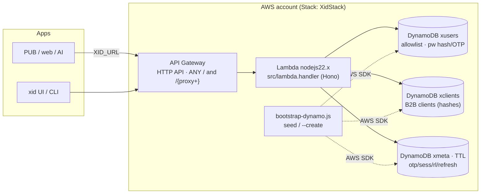

# OnMind-XID — AWS architecture (CDK)

Infrastructure as code for running XID on AWS:

- **API Gateway (HTTP API v2)** — single public front door for the apps
  (`PUB` / web / AI / M2M) and for xid itself (`XID_URL` / `XID_CF` point here).
- **AWS Lambda** (`nodejs22.x`) — runs the exact same Hono app
  (`src/index.js`) as the Cloudflare Worker and the Bun container. Handler:
  `src/lambda.handler`, packaged as a **repo-root asset** (no bundler).
- **DynamoDB (on-demand)** — three single-key tables that implement the same
  duck-typed KV interface as the CF Worker bindings:
  `xusers`, `xclients`, `xmeta` (see `src/dynamo.js`).

> CDK app is plain **JavaScript** (CJS, no TypeScript): `bin/app.js` +
> `lib/xid-stack.js`. Node ≥ 20 required.

## Diagram



Parity: `wrangler dev/deploy` (CF Worker), `bun src/dev.js` (container) and
Lambda all share `src/` — only the entrypoint and the storage binding differ.

## Resources

| Construct           | CFN type                  | Name / key props                                      |
| ------------------- | ------------------------- | ----------------------------------------------------- |
| `xusersTable`       | `AWS::DynamoDB::Table`    | `{prefix}xusers`, pk `S`, on-demand, PITR, RETAIN, deletion protection |
| `xclientsTable`     | `AWS::DynamoDB::Table`    | `{prefix}xclients`, same as above                     |
| `xmetaTable`        | `AWS::DynamoDB::Table`    | `{prefix}xmeta`, + TTL attribute `ttl`                |
| `XidFunction`       | `AWS::Lambda::Function`   | `nodejs22.x`, `src/lambda.handler`, 512 MB, 30 s, repo-root asset, explicit log group (14 d retention) |
| `XidHttpApi`        | `AWS::ApiGatewayV2::Api`  | HTTP API, stage `$default`, routes `ANY /` + `ANY /{proxy+}` → Lambda |
| outputs             | `CfnOutput`               | `ApiEndpoint`, `FunctionName`, table names           |

Stack outputs are printed after `cdk deploy`:

```text
ApiEndpoint  https://xxxxxxxx.execute-api.<region>.amazonaws.com
```

## Request flow

1. App calls `GET <ApiEndpoint>/healthz` (or any route; CORS allowlist is
   enforced **in the app** via `XID_CORS_ORIGINS`, not at the gateway).
2. HTTP API → Lambda → `hono/aws-lambda` adapter → `app.fetch(req, env)` with
   env = Lambda environment + the three `DynamoKV` bindings built by
   `createDynamoBindings()`.
3. Reads/writes go to DynamoDB (`pk` / `v` / optional `ttl`); OTP and refresh
   sessions expire via TTL **and** on-read validation (`src/dynamo.js`).

## Configuration reference

All config is **CDK context** (defaults in `cdk/cdk.json`, override with
`-c key=value`) plus one secret:

| Context              | Default        | Maps to / effect                                   |
| -------------------- | -------------- | -------------------------------------------------- |
| `jwtSecret`          | *(required)*   | `XID_JWT_SECRET` — prefer `export XID_JWT_SECRET=$(openssl rand -hex 32)` so the secret stays out of argv/history. ≥ 32 chars, enforced at synth |
| `tablePrefix`        | `""`           | table names `{prefix}xusers/xclients/xmeta` (multi-env accounts) |
| `xidEnv`             | `production`   | `XID_ENV` (`production` ⇒ Secure cookies, strict redirect checks) |
| `removalPolicy`      | `retain`       | `retain` \| `destroy` — see “DynamoDB in production” |
| `deletionProtection` | `true`         | blocks even explicit `DeleteTable` while stack exists |
| `pointInTimeRecovery`| `true`         | 35-day PITR                                         |
| `terminationProtection` | `false`      | CloudFormation stack deletion guard (enable in prod) |
| `corsOrigins`        | `""`           | comma list → `XID_CORS_ORIGINS`                     |
| `redirectAllowlist`  | `""`           | comma list → `XID_REDIRECT_ALLOWLIST`               |
| `tenantId` / `clientId` | `""`        | `XID_TENANT_ID` / `XID_CLIENT_ID` (Entra/Cognito)   |
| `xinUrl`           | `""`           | OnMind-XIN base URL → `XID_XIN_URL` (OTP mail via `POST /send`; also reads `XID_XIN_URL` env at synth) |
| `xinApiKey`        | `""`           | optional XIN key → `XID_XIN_API_KEY`; prefer `export XID_XIN_API_KEY=...` (same secrecy caveat as `jwtSecret`) |
| `localEndpoint`      | `""`           | emulator URL → `AWS_ENDPOINT_URL` + `XID_DYNAMO_ENDPOINT` inside the Lambda (Floci/LocalStack) |

Lambda environment (set by the stack): `XID_ENV`, `XID_JWT_SECRET`,
`XID_USERS_TABLE`, `XID_CLIENTS_TABLE`, `XID_META_TABLE`, plus the optional
list vars above — and `XID_XIN_URL` / `XID_XIN_API_KEY` when `xinUrl` /
`xinApiKey` are given. Mail on Lambda goes through **XIN over HTTP**
(`POST /send`, no SMTP needed); without `xinUrl`, passwordless OTP fails fast
with `400 mail_unavailable` and login stays password-only (bcrypt in `xusers`).

### Lambda asset packaging

`Code.fromAsset(repoRoot)` zips the repository tree **excluding**:
`.git`, `.github`, `.wrangler`, `cdk/` (this app), `PLAN.md`, `xusers.txt`,
`xclients.txt`, `.dev.vars`, `files/` (local demo uploads), `*.log`, `bun.lock`.
Everything else ships: `src/`, `scripts/`, `cli/`, `vendor/` (CUI assets),
`node_modules/` (~20 MB asset total). Re-include `files/` deliberately (remove
from the exclude list) if the File API must ship content.

## DynamoDB in production

Defaults are intentionally conservative — **a `cdk destroy` never loses data**:

| Setting                | Default   | Why                                                                 |
| ---------------------- | --------- | ------------------------------------------------------------------- |
| `removalPolicy`        | `RETAIN`  | Table (and data) stays in the account after stack deletion; CloudFormation simply stops managing it |
| `deletionProtection`   | `enabled` | Defense in depth: even a hand-issued `DeleteTable` / console delete is rejected until you disable it explicitly |
| `pointInTimeRecovery`  | `enabled` | 35-day point-in-time recovery (continuous backups, restore to any second) |
| `billingMode`          | `PAY_PER_REQUEST` | on-demand — no capacity planning, pay per request/WRU |
| TTL on `xmeta`         | `ttl`     | OTP/session/refresh keys auto-delete (lazy ≤ 48 h); app also enforces expiry **on read** so behaviour is exact |
| Encryption             | AWS-owned | default S3-backed encryption for DynamoDB (no KMS costs); increase to `TableEncryption.CUSTOMER_MANAGED` if policy requires CMK |
| Log group              | RETAIN + 14 d | function logs survive destroy, expire after 14 days |

Notes:

- **Seeding**: tables are created by CDK; data (allowlist / B2B clients) is
  written with `bun run kv:dynamo --apply` (or `--create` on real AWS — it is
  idempotent via `DescribeTable`). See the repo README “Storage” section.
- **Destroy semantics (prod)**: `cdk destroy` removes API/Lambda and *keeps*
  the tables. A later redeploy will try to create tables with the same names —
  either keep the stack (normal case) or import the retained tables /
  change `tablePrefix` before recreating.
- **Throwaway envs** (Floci, CI): pass
  `-c removalPolicy=destroy -c deletionProtection=false -c pointInTimeRecovery=false`
  so everything is disposable.
- Schema (`pk` S, `v` S, optional `ttl` N) is shared by CDK,
  `scripts/bootstrap-dynamo.js` and `src/dynamo.js` — change all three together.

## Deploy (real AWS)

```bash
# one-time
export AWS_PROFILE=your-profile
export XID_JWT_SECRET=$(openssl rand -hex 32)   # never commit this
cd cdk && npm install
npx cdk bootstrap                                # once per account/region

# every deploy
npx cdk diff
npx cdk deploy \
  -c corsOrigins=https://app.example.com \
  -c redirectAllowlist=https://app.example.com \
  -c xinUrl=https://xin-api.example.com
# → ApiEndpoint output

# seed allowlist + clients into the deployed tables
cd .. && bun run kv:dynamo --apply
```

Then set the apps' `XID_URL` (or `XID_CF`) to the `ApiEndpoint` output.

## Test with the Floci simulator

[Floci](https://github.com/floci-io/floci) is a free open-source,
LocalStack-compatible AWS emulator (drop-in endpoint on **:4566**) with
**real Docker-backed Lambda** execution and emulated DynamoDB, API Gateway v2,
S3, CloudFormation… — enough to deploy this whole stack locally.

```bash
# 1. start Floci (docker socket = real Lambda execution)
docker run -d --name floci -p 4566:4566 \
  -v /var/run/docker.sock:/var/run/docker.sock \
  floci/floci:latest
# (or: floci start && eval "$(floci env)")

# 2. point the AWS SDK/CDK at the emulator (SDK v3 honours AWS_ENDPOINT_URL)
export AWS_ENDPOINT_URL=http://localhost:4566
export AWS_ACCESS_KEY_ID=test AWS_SECRET_ACCESS_KEY=test AWS_REGION=us-east-1
export AWS_PAGER=
export CDK_DEFAULT_ACCOUNT=000000000000 CDK_DEFAULT_REGION=us-east-1
export XID_JWT_SECRET=$(openssl rand -hex 32)

# 3. bootstrap + deploy a disposable stack
cd cdk
npx cdk bootstrap
npx cdk deploy \
  -c removalPolicy=destroy \
  -c deletionProtection=false \
  -c pointInTimeRecovery=false \
  -c localEndpoint=http://host.docker.internal:4566
# Linux: add  --add-host=host.docker.internal:host-gateway  to the Lambda's Docker
#        run (Floci flag), host.docker.internal resolves on Docker Desktop.

# 4. seed tables (SDK on your host talks to Floci too)
cd .. && bun run kv:dynamo --apply

# 5. exercise the API (read ApiEndpoint from the stack outputs)
API=$(aws cloudformation describe-stacks --stack-name XidStack \
      --query "Stacks[0].Outputs[?OutputKey=='ApiEndpoint'].OutputValue" --output text)
curl -fsS "$API/healthz"
curl -fsS -X POST "$API/v1/token" -H 'content-type: application/json' -d '{"grant_type":"client_credentials", ...}'

# 6. tear down (tables are disposable thanks to the flags above)
cd cdk && npx cdk destroy -y
```

`localEndpoint` is what makes the Lambda inside Floci reach Floci's DynamoDB:
it sets `AWS_ENDPOINT_URL` (global SDK v3 override) **and**
`XID_DYNAMO_ENDPOINT` (used directly by `src/dynamo.js`). On real AWS you
leave `localEndpoint` empty and the SDK talks to `dynamodb.<region>.amazonaws.com`.

A second, lighter test path (no CDK): run only the storage layer against Floci —
`AWS_ENDPOINT_URL=http://localhost:4566 bun run kv:dynamo --create --apply`.

## Security notes

- `XID_JWT_SECRET` is required (≥ 32 chars) and lands in the Lambda
  environment / CFN template (`cdk.out` is git-ignored). Rotate per deploy;
  move to **Secrets Manager** (`secretValueFromJson`) when hardening for
  long-lived prod.
- Passwords are bcrypt hashes in `xusers` (`email:$2b$…`); B2B client secrets
  are hashed in `xclients`; OTP/session material lives only in `xmeta` with TTL.
- CORS and redirect allowlists are enforced by the app (same behaviour on all
  three runtimes); the gateway adds no second policy to keep parity.
- Asset packaging never ships `xusers.txt` / `xclients.txt` / `.dev.vars`.

## Commands

```bash
cd cdk
npm run synth      # cdk synth (needs XID_JWT_SECRET)
npm run diff       # cdk diff
npm run deploy     # cdk deploy
npm run destroy    # cdk destroy
npm run bootstrap  # cdk bootstrap (once per account/region)
```
